# Add a Subprocess to an Automation
<!-- description --> Learn how to use a subprocess in SAP Build Process Automation.

## Prerequisites
- Complete [Add Links to Forms](spa-add-links-forms)
- Complete [Agent Management Settings to Execute the Process with an Automation](spa-run-agent-settings)

## You will learn
  - How to add a subprocess in a process.
  - How to add a subprocess in an automation.
  - How to send tasks to multiple participants.

---

## Intro

Using subprocess in your automation enables you to easily reuse existing code segments in various processes. This re-usability eliminates the need for duplicating the same code multiple times, saving you valuable time and development efforts.

Furthermore, incorporating subprocess in your automation allows you to divide your tasks into smaller and more manageable units. This simplifies the comprehension and maintenance of your automated system.

---
### Create a subprocess in a process project

You will incorporate a subprocess within a primary process.

After completing the [prerequisites](https://developers.sap.com/tutorials/spa-add-links-forms.html), your process will look like this:
    
<!-- border -->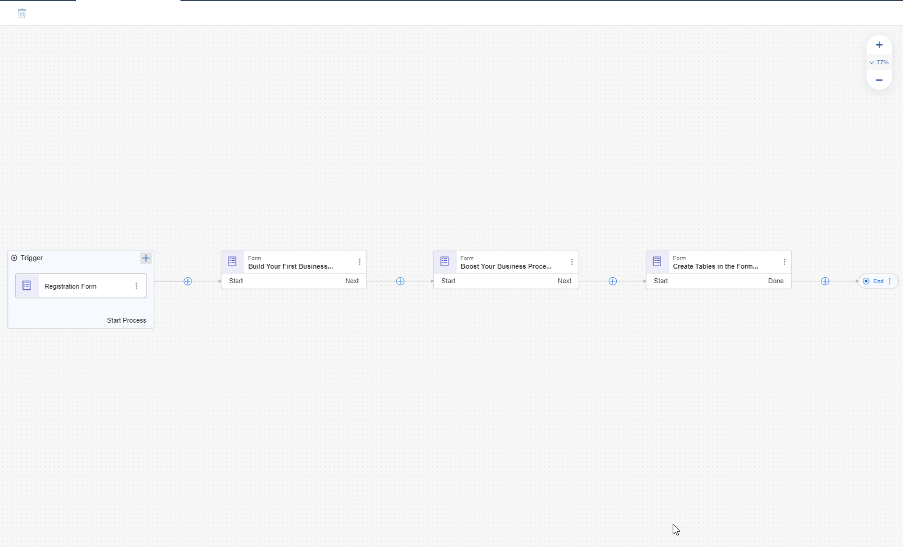

1. Navigate to the **Overview** tab, from the editable version of your project, click the **Create** dropdown and choose **Process**.

    <!-- border -->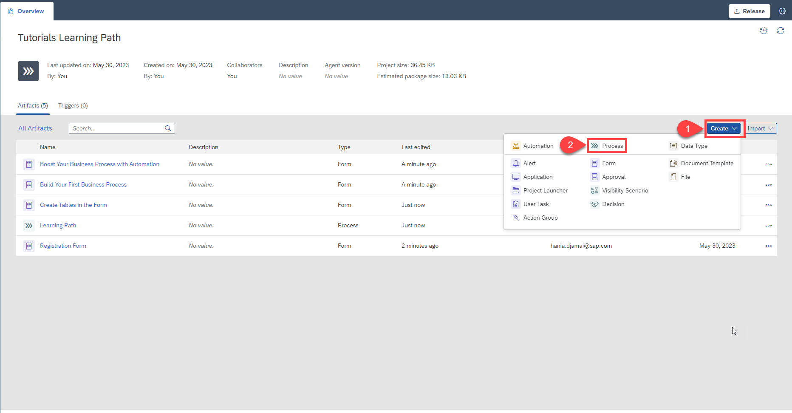

2. In the **Create Process** dialog box, do the following:

    - Enter a **Process Name** such as Manage Trainees Learning Journey.
    - Choose **Create**.

    <!-- border -->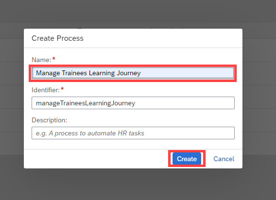

    Your new process opens in the process builder. You will now create a trigger form that will start the process. 

    <!-- border -->

3. Choose **+** in the **Trigger** settings, then select **Forms** and choose **Registration Form**.

4. Choose **Save**.

    <!-- border -->

5. Navigate back to the **Overview** tab. Select the **Learning Path** process.

    <!-- border -->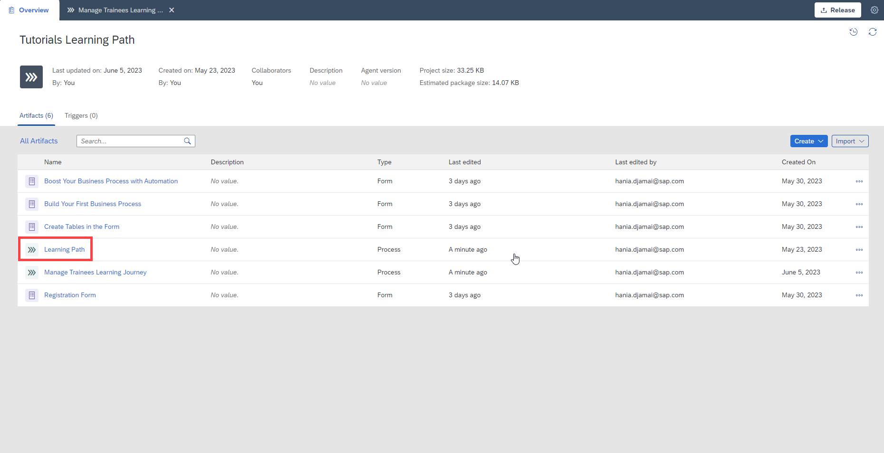

6. Choose the three dots of the Trigger form and select **Remove**.

7. Choose **Save**.

    <!-- border -->

8. Go back to **Manage Trainees Learning Journey** process, select **+** and choose **Subprocesses>Learning Path**.

9. **Save** the process.

    <!-- border -->

    Now you have an optimized process that incorporates a subprocess, making it more efficient and streamlined.

    <!-- border -->

### Release, deploy and run the process project

1. To release and deploy a process, please refer to step 1 and 2 of the tutorial on how to release and deploy a process [Run the Business Process](https://developers.sap.com/tutorials/spa-run-process.html).

2. In the **Overview** section, open the process **Manage Trainees Learning Journey** process of the deployed version, choose **Registration Form** and select the **Copy Link** icon under the **Form Link** field.

    <!-- border -->

3. Now paste the **Form Link** into a browser. When the form opens in the browser, you will have the course presentation fields that you defined in the Registration Form. Click on **Start**.    

    <!-- border -->

    Now, you will receive the training materials directly in your inbox, just like you did in the [Add Links to Forms](https://developers.sap.com/tutorials/spa-add-links-forms.html) tutorial.

    >In the next steps, you will cover the usage of a subprocess within an automation and also demonstrate how to distribute the learning path to multiple learners simultaneously.

### Add a table to the Registration Form

After completing the steps above, your process will look like this:
    
   <!-- border -->

1. From the editable version of your project, choose the three dots and select **Open Editor**.

     <!-- border -->

2. Add a **Table** with **Learners** as title.

     <!-- border -->

3. Choose the **+** icon in the table and select **Text**. Enter **First Name** as the field name.

    <!-- border -->

    <!-- border -->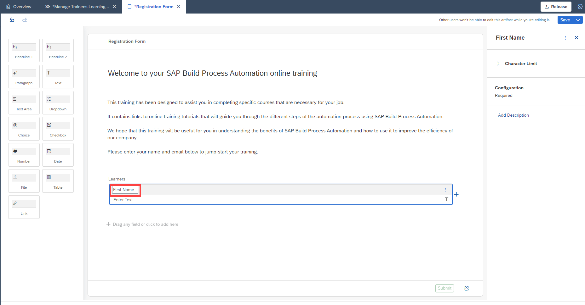

4. Choose the **+** icon next to the First Name field and select **Text**. Enter **Last Name** as a field name.

    <!-- border -->
    <!-- border -->

5. Similarly choose the **+** icon next to the Last Name field and select **Text**. Enter **Emails** as a field name.

    <!-- border -->
    <!-- border -->

6. **Save** the form.

### Create the automation

1. Navigate back to the **Manage Trainees Learning Journey** process and do the following:

    - Select the three dots next to the **Learning Path** subprocess and choose **Remove**.
    
    <!-- border -->

    > ### What's going on?
    >
    > You will remove the subprocess from the main process. Our objective is to create an automation that utilizes the **Learning Path** subprocess to send the learning path to multiple users at once.

    - Now choose **+**.
    - Select **Automation**, **New Automation**.

    <!-- border -->

2. A pop up will appear to configure the Desktop Agent version. Do the following in the pop up:

    - From the dropdown, select the version of the Desktop Agent installed on your machine. It would be displayed with suffix as **Registered**.
    - Choose the **Confirm** button.

    <!-- border -->

3. A new pop-up will appear to create the automation. Do the following in the pop-up:

    -  Under Name enter: **Assign Learning Journey**.
    -  Choose the **Create** button.

    <!-- border -->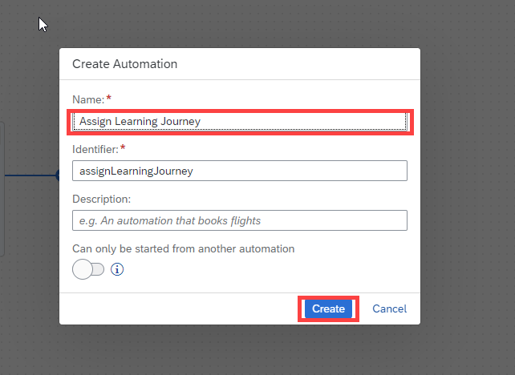

    An automation **Assign Learning Journey** will be created successfully.

4. Choose **Save**.

    <!-- border -->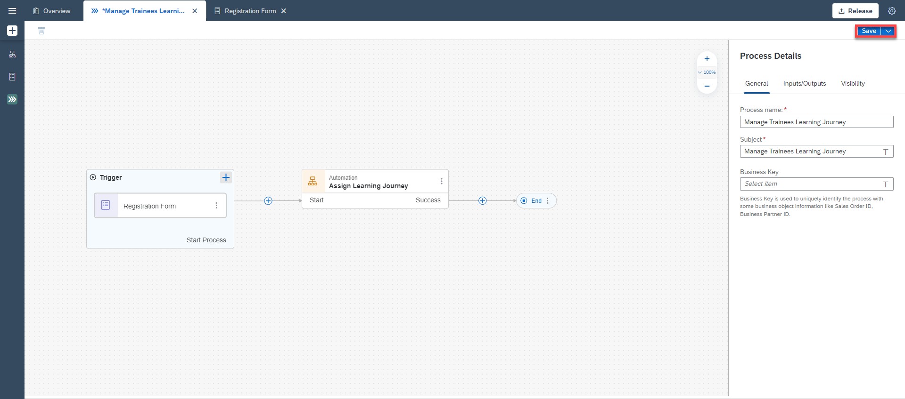

### Create data types

1. Go to the **Overview** Tab. Choose the **Create** button. Create an artifact of the type **Data Type**.

    <!-- border -->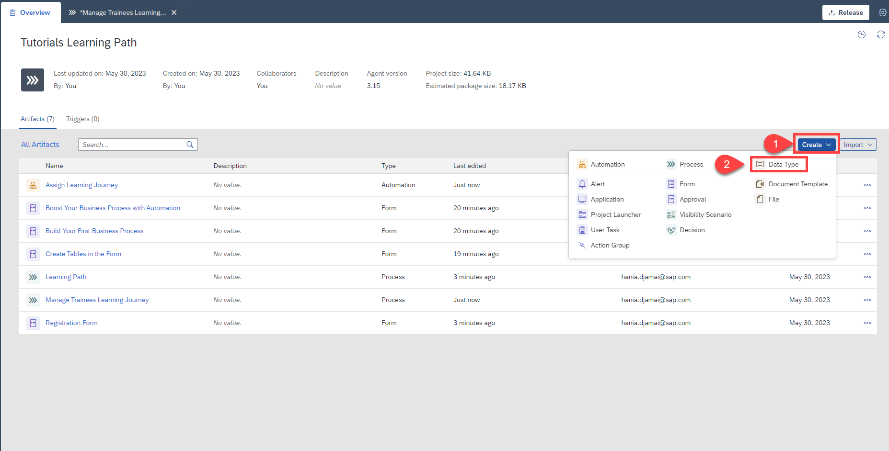

2. A new pop-up will appear.
    - Enter **Name** of the data type: **Learner**.
    - Choose **Create**.

    <!-- border -->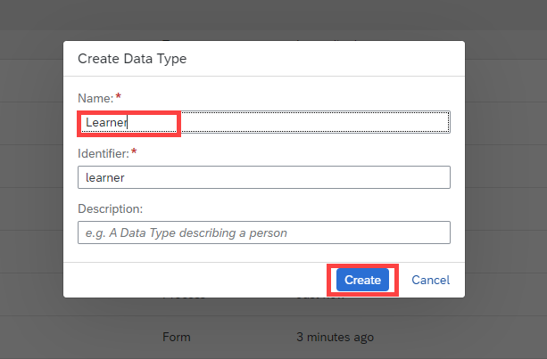

3.  In the Data Type **Learner** add 3 new fields as such:.

    |  Field Name           | Type
    |  :-------------       | :-------------
    |  `email`              | String
    |  `firstname`          | String
    |  `lastname`           | String

    <!-- border -->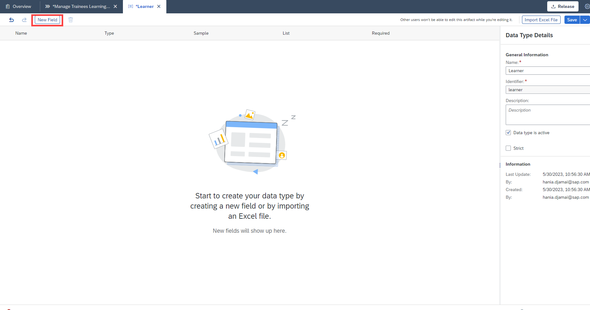

    <!-- border -->

4. Choose **Save**.

    <!-- border -->

    Now you will create a second data type.

5. Similarly, go to the **Overview** tab. Choose the **Create** button. Create an artifact of the type **Data Type**.

    <!-- border -->

6. A new pop-up will appear.
    - Enter **Name** of the data type: **dataset**.
    - Choose **Create**.

    <!-- border -->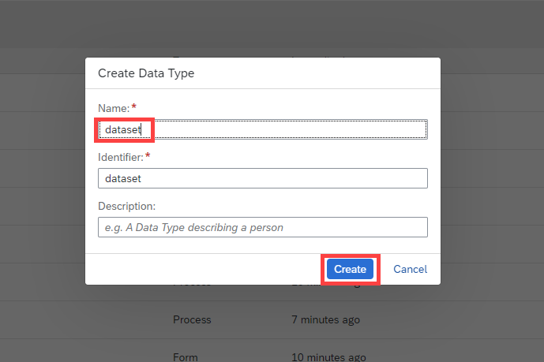

7.  In the Data Type **dataset** add a new field such as:

    |  Field Name           | Type
    |  :-------------       | :-------------
    |  `Learner`            | Learner

    <!-- border -->

8. Check List. 

9. Choose **Save**.

    <!-- border -->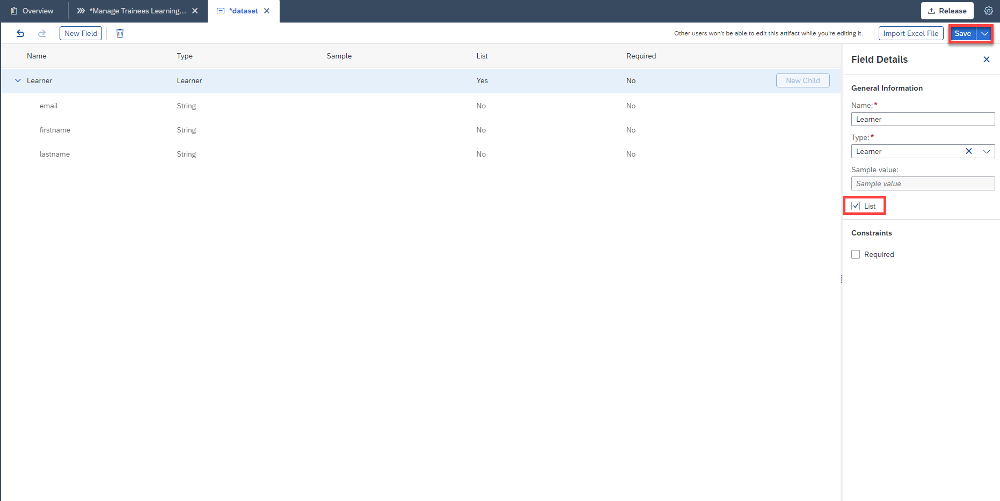

### Configure the automation

1. Navigate back to the **Manage Trainees Learning Journey** process and select the three dots next to **Assign Learning Journey** automation, choose **Open Editor**.

    <!-- border -->

2. In the Automation Details section on the right, search for the **For Each** activity and drag and drop the activity into the automation flow.

    <!-- border -->

3. Click on the canvas and select the **Input/Output** section in Automation Details. 

    <!-- border -->

4. Add Input parameters as following:

    - In Parameter Name enter: `learner`.
    - In Data Type choose: **Learner**.
    - Check **List**.

    <!-- border -->

5. Click on the **For Each**, enter the value of Set looping List as `learner`.

    <!-- border -->

6. Click on the canvas and select the **Processes** section in Automation Details. 

    <!-- border -->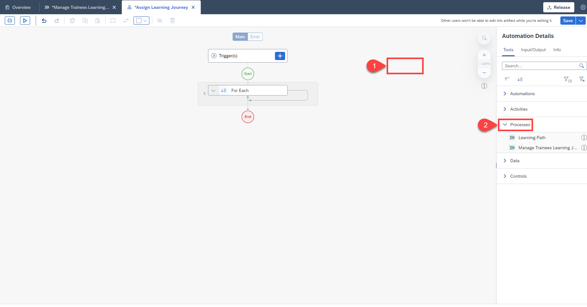

7. Select **Learning Path** and drag and drop the activity into the automation flow inside the **For Each** loop.

    <!-- border -->

8. **Save** your work.

### Configure the subprocess

1. Go to the **Overview** tab. Select the **Learning Path** process.

    <!-- border -->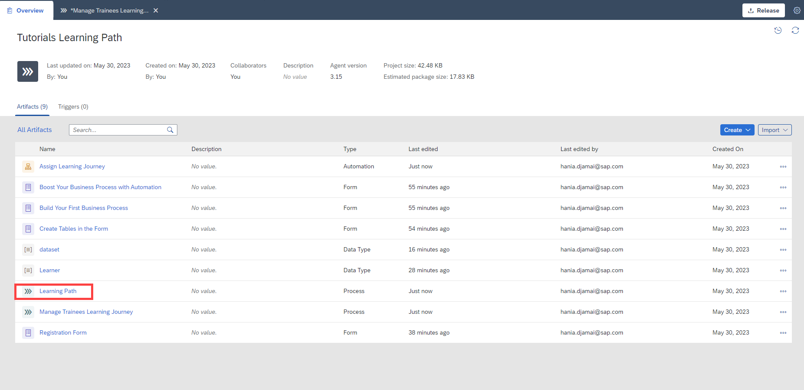

2. Select the **Input/Output** section in Process Details.

    <!-- border -->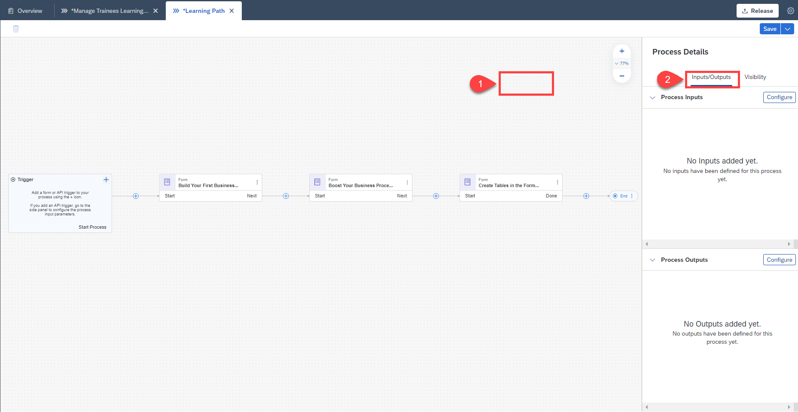

3. Select **Configure** and click on **add input**.

    <!-- border -->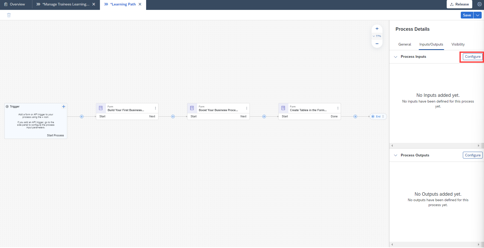

    <!-- border -->

4. Configure the **Process Input** as such: 

    - In Inputs Name enter: `learners`.
    - In Inputs Type choose: **Learner**. 

5. Select **Apply**.

    <!-- border -->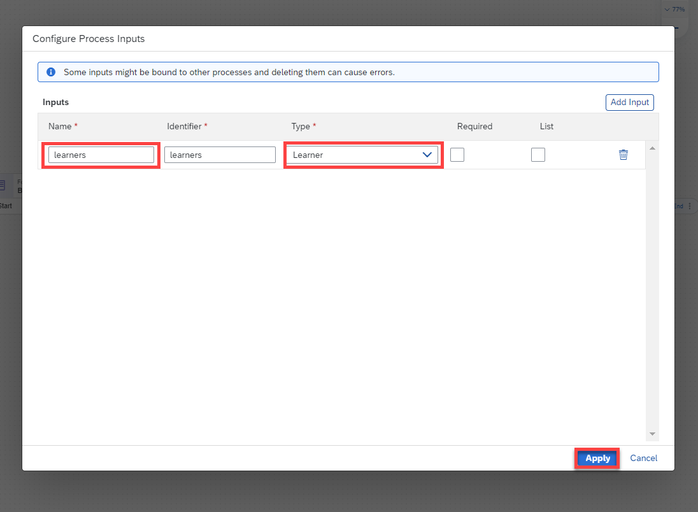

6. Now, click on **Build Your First Business Process** form and configure the **General** section.

    <!-- border -->

7. In the **Recipients** section, under **Users** select **email**.

    <!-- border -->

8. Select the **Boost your Business Process with Automation** form to configure the **General** section. In the **Recipients** section, under **Users** select **email**.

    <!-- border -->

9. Similarly, select the **Create Tables in the Form** form to configure the **General** section. In the **Recipients** section, under **Users** select **email**.

    <!-- border -->

10. **Save** your work.

11. Go to the **Overview** tab. Click on the **Assign Learning Journey** automation.

    <!-- border -->

12. Select **Learning Path** and enter the value of learners as `currentMember`.

    <!-- border -->

13. **Save** your work.

14. Navigate back to **Manage Trainees Learning Journey**, select **Assign Learning Journey** automation to configure the **Inputs** parameters.

    <!-- border -->

15. In the **Inputs** section, in **Select list** field, choose **Learners**.

    <!-- border -->

16. **Save** your work.

### Release and deploy the project

After completing [Agent Management Settings to Execute the Process with an Automation](spa-run-agent-settings) tutorial, you may release and deploy the process.

1. In the **Manage Trainees Learning Journey** process, choose the **Release** button on the top right corner.

    <!-- border -->

2. In the **Release Project** popup, select **Release**.

    <!-- border -->

3. On the **Overview** section that appears, choose **Deploy**.

    <!-- border -->

4. In the popup that appears, run the deployment.

    <!-- border -->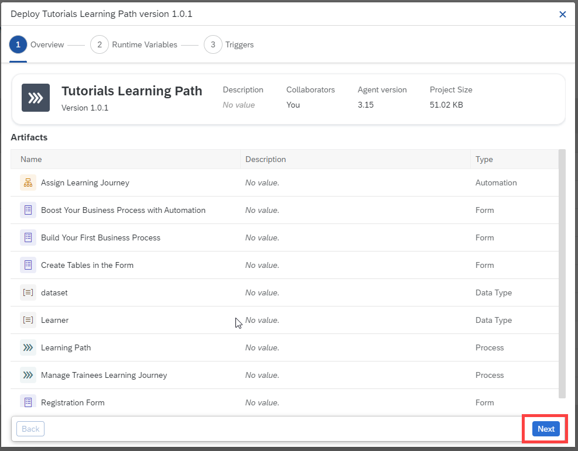
    <!-- border -->
    <!-- border -->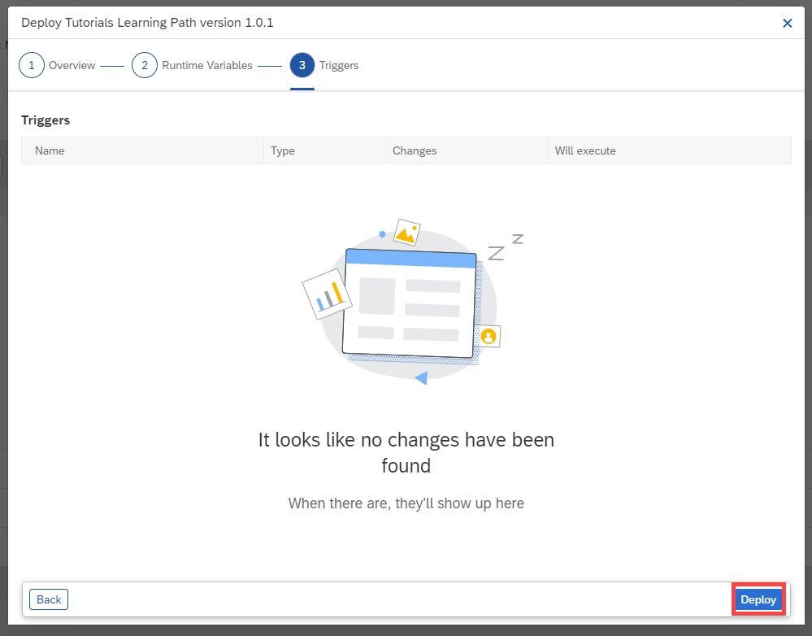

5. After project deployment, a confirmation popup will appear. Choose **Close**.

    <!-- border -->

### Run the process

1. In the **Overview** section, open the process **Manage Trainees Learning Journey** of the deployed version, choose **Registration Form** and select the **Copy Link** icon under **Form Link** field.

    <!-- border -->

2. In a new tab in your browser, paste the form link. Enter the information of the learners in the table for whom you intend to send the learning path and choose **Submit**.

    <!-- border -->

   
    > After clicking on **Submit**, all the learners you have added to the table will receive the project tasks in their Inbox.

3. Navigate to **SAP Build** lobby, choose **My Inbox** icon.

    <!-- border -->

4. You will see the first task **First Learning Mission** appear in the My Inbox application that ships with SAP Build. The task will have the description of the training to be followed and the link to the tutorial. After finishing the mission, select **I have completed the first mission** and click on **Next**.

    <!-- border -->

5. Refresh the inbox again to get the second notification for the second mission. Now you can see task **Second Learning Mission** appear in My Inbox. After finishing the mission, click on **Next**.

    <!-- border -->

6. Similarly, refresh the inbox again to get the third mission. Once the mission is completed, click on **Done**.

    <!-- border -->

