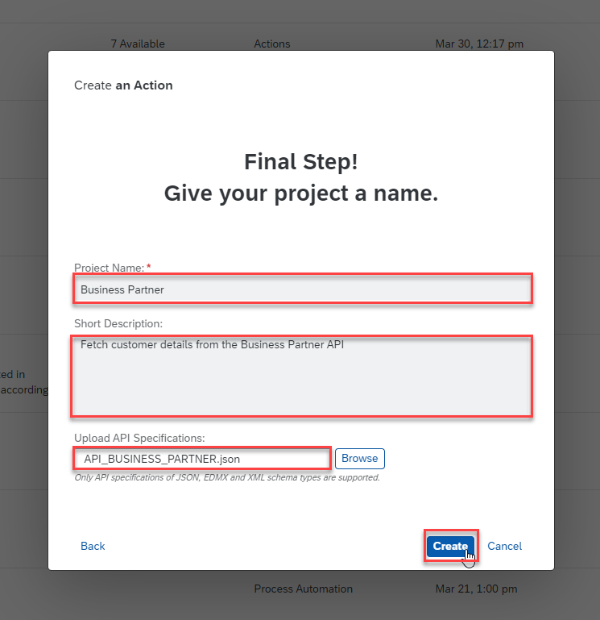
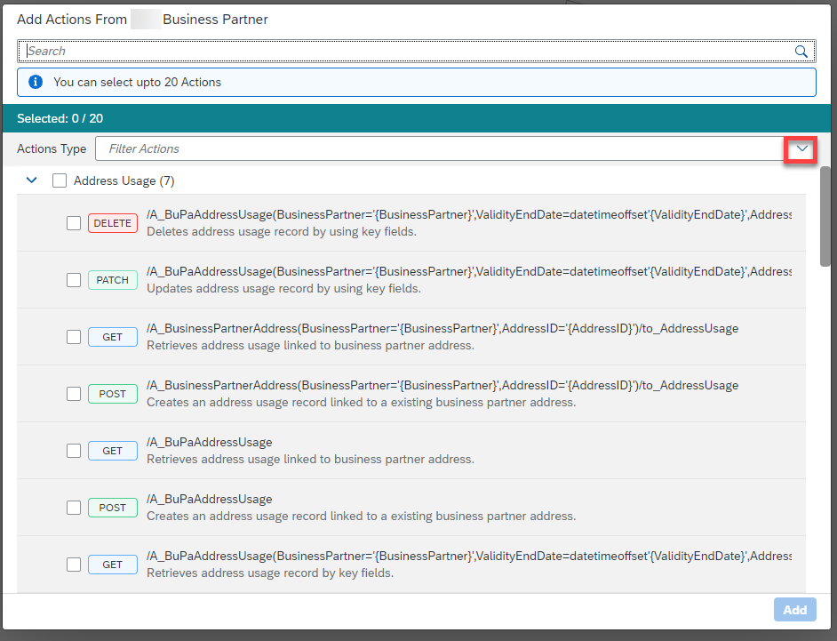
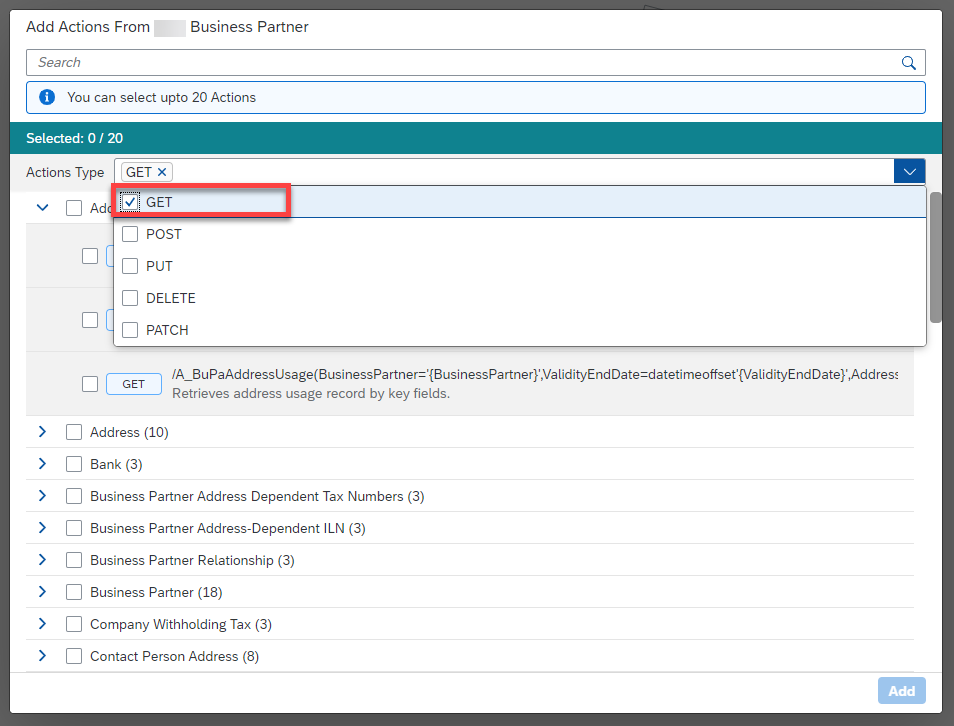
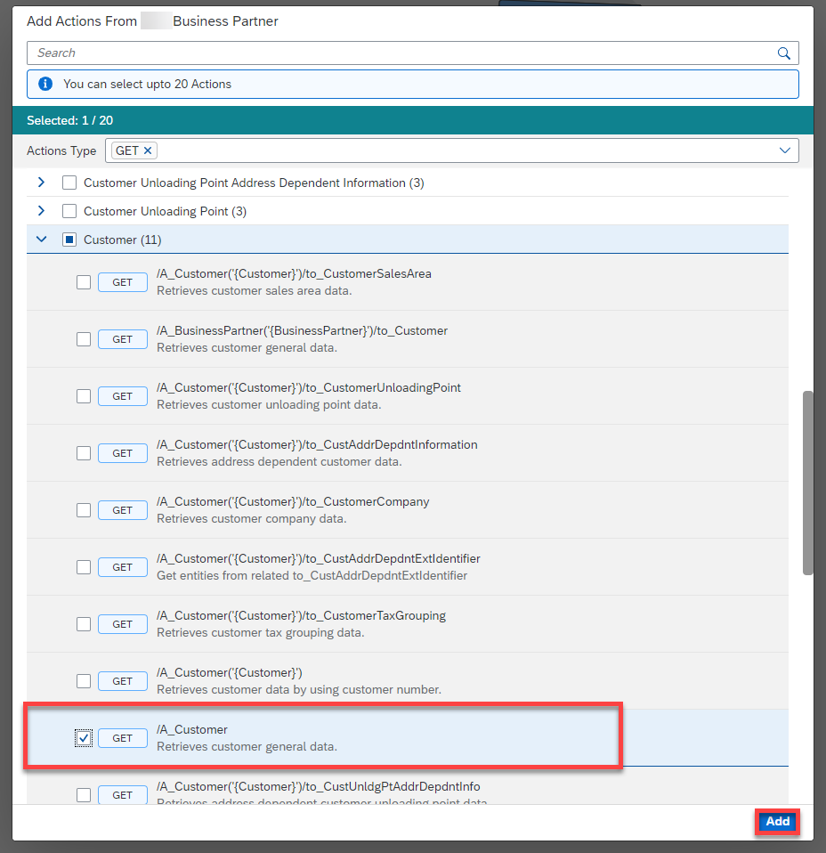
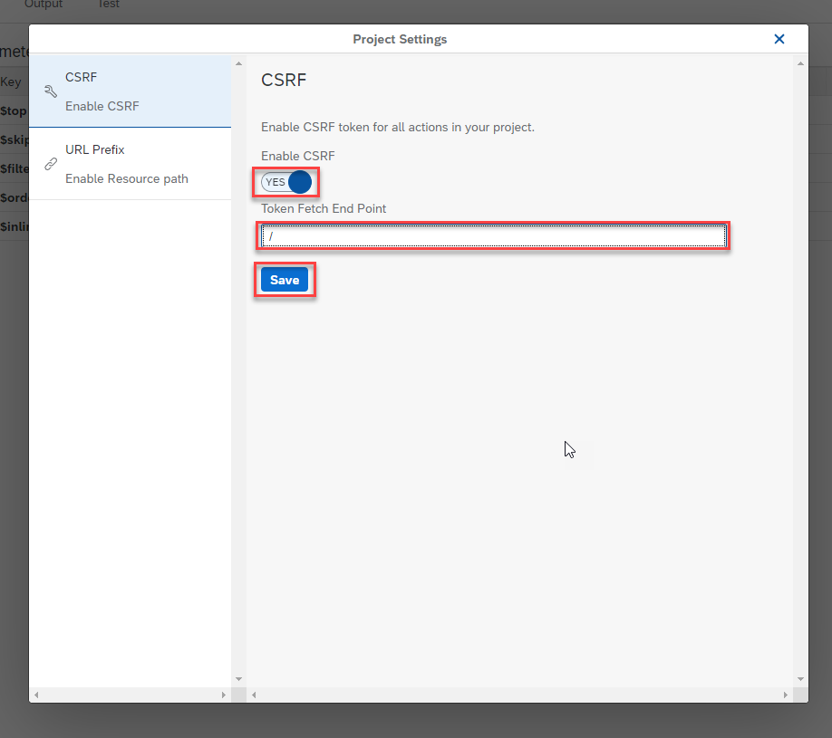
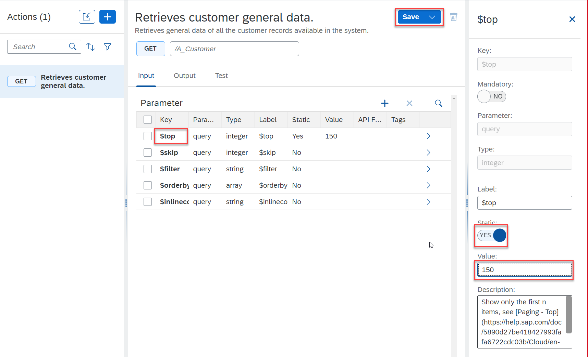
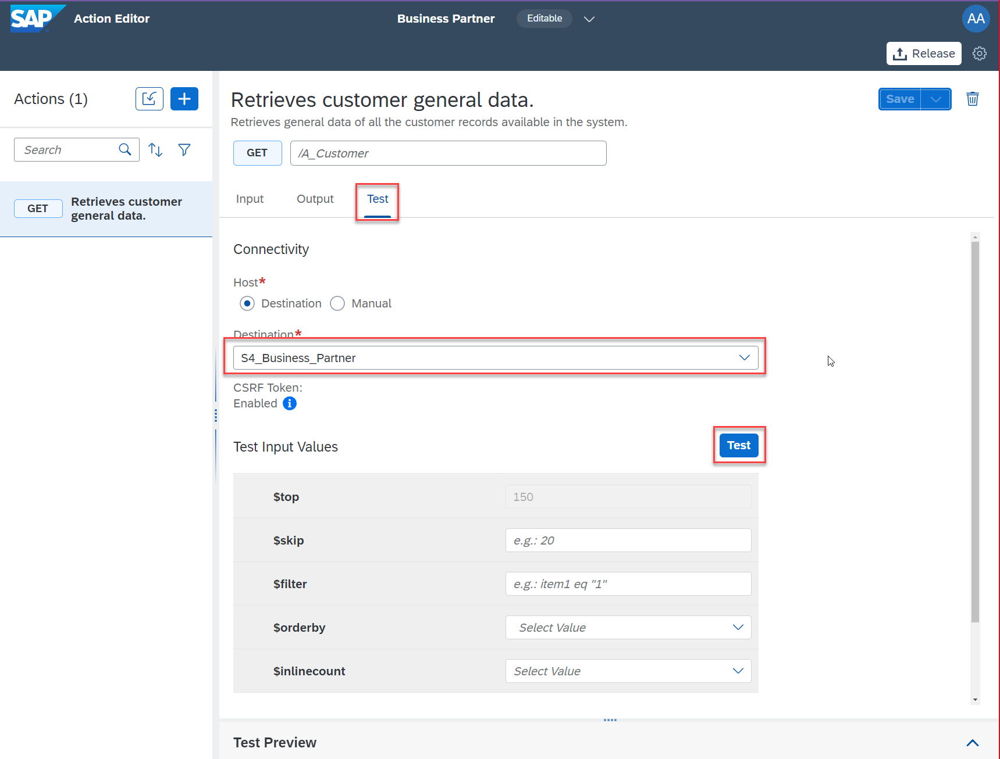
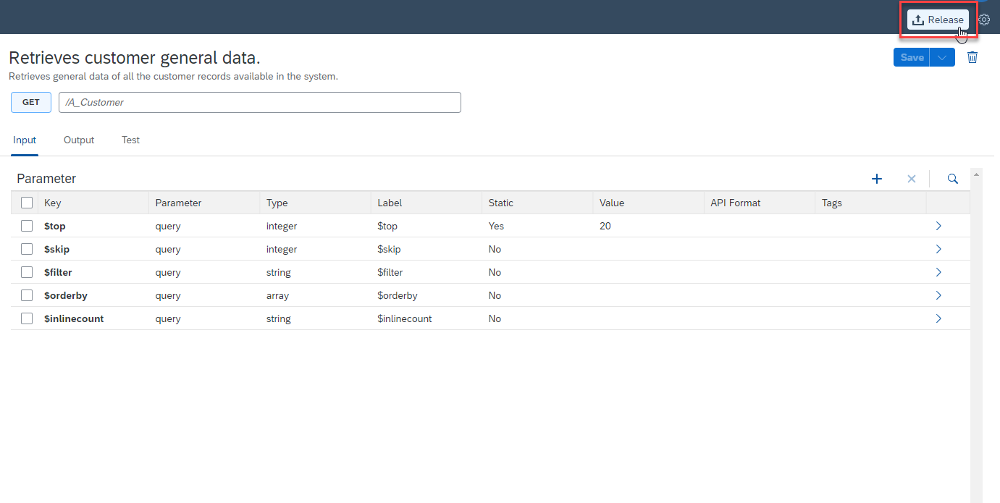

# Create Action Project in Lobby
<!-- description --> Create an action project in lobby from Open API specification

## Prerequisites
- [SAP BTP Free Trial Account](https://blogs.sap.com/2022/09/09/sap-process-automation-now-available-in-your-trail-account/)  **OR**
  [SAP BTP Free Tier Account](spa-subscribe-booster) with the SAP Build Process Automation enabled
- Complete the tutorial [Setup Environment](spa-dropdown-value-help-filtering-setupenv)
- S/4HANA Cloud system where Business Partner module is available
- A communication user to access S/4HANA Business Partner inbound services based on `SAP_COM_0109` communication scenario ID

## You will learn
- to discover APIs in SAP API Business Hub
- to download Open API specification
- to create action project based on the API specification
- to configure API methods to update title, input and output fields and their description to improve readability for business users
- to test API using destination option
- to release and publish action project to be consumed in the business process modelling

## Intro
Action is a feature in **SAP Build Process Automation** to connect processes with external systems, be it SAP or non-SAP systems. This is an important piece of the puzzle especially if you want to automate or extend your business processes for any available LoB processes like S/4HANA, `Ariba`, SuccessFactors etc. These extensions can be easily build using SAP Build Process Automation, and using actions you can connect to your given S/4HANA, `Ariba` or other SAP LoB systems for any kind of GET, POST, PATCH and other calls.

In this tutorial, you will create an action project based on Business Partner API. The [Business Partner (A2X)](https://api.sap.com/api/API_BUSINESS_PARTNER/overview) API is already available in API Business Hub. For this workshop you will leverage **Customer - GET API** which will be used to fetch the customer details from S/4HANA system.

### Download open API specification

1.  [Download and extract](https://www.sap.com/registration/trial.f47300f6-63b8-4f22-b189-dbadd3c903d6.html?id=0055000000004992023) **Open API Specification** zip file for **Business Partner (A2X)** API in your local file system.

> Open API specification of 2.x or 3.x or higher is needed for creating action project. For APIs that are available in [SAP API Business Hub](https://api.sap.com), you can directly download the specification from the API overview section. For example: The API specification that will be used for fetching customer details in this exercise is downloaded from [here](https://api.sap.com/api/API_BUSINESS_PARTNER/overview).

### Create action project

2.	Open **SAP Build Lobby** with your username and password:

    - then click **Create**.

    <!-- border -->

3. In the popup, choose **Build an Automated Process** and then select **Actions**.

    <!-- border -->

4. In the popup, do the following:
    - Enter the **Project Name** as **Business Partner**.
    - Enter the **Short Description** as **Fetch customer details from the Business Partner API**.
    - Click to **Browse** the open specification file downloaded in step above.
    - Click **Create**.

    <!-- border -->

5. Wait for the action project to be created in the Lobby.

    <!-- border -->

### Configure action project

1. Once the action project is created, select it to open the Action Editor. The **Add Actions From Business Partner** pop up will automatically open. In the popup, you have to select *GET* method of `/A_Customer` API. You can either directly search from the given list of APIs or follow the steps below:

    - Select **filter** option.

    <!-- border -->

    - Select **Actions Type** >> **GET**.

    <!-- border size:540px -->

    - From the filtered list of APIs, choose **Customer** and select **GET** option for `/A_Customer` API.

    - Click **Add**.

    <!-- border -->

    The Action Editor will open with the selected APIs which can be further configured based on the requirements.

2. As S/4HANA APIs need CSRF token, click on the **Settings** icon at the top right.

    <!-- border -->

    - In the popup, toggle the **Enable CSRF** button to **YES** and enter **/** in the **Token Fetch End Point** field and click **Save**.

    <!-- border -->

3. Since the Action can fetch a limited number of records, you need to configure the `$top` input parameter to a specific value. For this use case, you will be fetching 150 records.

    - Select the **$top** parameter.
    - In the side panel, toggle the **Static** option to **YES**.
    - Enter **150** in the **Value** field.
    - Select **Save**.

    <!-- border -->

    With this you have configured the action project name, CSRF token and API input fields.

4. Similarly, configure the output fields. Do the following:

    - Click **Output** tab.
    - Expand the output key **d**.
    - Select the **results** key.
    - In the side menu, select the **Tags** dropdown and choose **Main Output Array**.
    - Choose **Save**.

    <!-- border -->

    > ### What is going on?
    > The action response doesnot return the main array of customer names. It is embedded under other response parameters. You need to mark the main output array from the response in order to make the action visible in the process builder.

### Test action project

1. Once the action project is configured and saved, it is time to test the changes and output. To test the API, do the following:

    - Click **Test** tab.
    - Select **Destination** option under **Connectivity**.
    - Select `S4_Business_Partner` from the dropdown options.

    > The destinations are fetched from the SAP Business Technology Platform. The selected destination is already created in the account configured for this tutorial.

    > Notice that the input value is already picked from the default value entered while configuring the action project.

    - Click **Test**.

    <!-- border -->

    - Once the execution is successful, you see **200 OK** response with the details of the customers in the backend S/4HANA Cloud system.

    <!-- border -->

### Release action project

You will now release the action project to create version(s) and then publish a selected version in the action repository. It is then these published actions that can be used in different processes and applications to connect to external systems.

- To release a version of the action project, click **Release** from top-right corner.

<!-- border -->

- In the release popup, enter the **Release Notes** of your choice and click **Release**.

> Notice the version of the project. It is in `majorVersionNumber.minorVersionNumber.patchNumber` format.

<!-- border -->

### Publish action project

Once the action project is released, you can then publish any released version of the action by clicking **Publish to Library** from top-right corner.

<!-- border -->

With this you have successfully completed creating, configuring, releasing and publishing of action project. Now you will use these published actions to connect process to external systems via APIs.
