# Build Your Automation Using Microsoft 365 Cloud SDK of SAP Build Process Automation
<!-- description --> Use Microsoft 365 Cloud Office SDK to automate Microsoft Cloud products

## Prerequisites
 - A Windows PC
 - If you are using a MAC, please install a VDI
 - [Trial account](spa-subscribe-free-trial) with SAP Build Process Automation enabled **OR**
 - A regular account with [SAP BTP Free Tier](spa-subscribe-booster) service plan for SAP Build Process Automation
 - [Install and Setup the Desktop Agent](spa-setup-desktop-3-0-agent)
 - Configure [Azure Application](https://help.sap.com/docs/intelligent-robotic-process-automation/cloud-studio-user-guide/configure-azure-application-and-use-with-microsoft-365-sdk#loio8d47b169478a46bd91c506c51e0872b3) 
 - Download and save [Sales Order Data](https://github.com/sap-tutorials/sap-build-process-automation/blob/50c942bbd0a7612e1cb672134578e517786e7b0e/tutorials/spa-create-automation/Orders.xlsx) on your SharePoint or OneDrive.

## You will learn
- How to use Microsoft 365 Cloud Office SDK Activities

## Intro
After completing this tutorial, you will be able to search for an Excel file on SharePoint or OneDrive, download it and store it on your local machine, read Excel data for a given range and send an email via Outlook Online with the new Excel file as an attachment. 

---

### Create External Authentication

Once you have successfully configured the Azure Application as mentioned in Pre-requisites, you are now ready to create an external authentication in SAP Build Process Automation Tenant.

1. Log in to SAP Build Process Automation Tenant.

2. Navigate to **Settings > External Authentication**.

    <!-- border -->

3. On the External Authentication page, click **Create New Authentication**.

    <!-- border -->

4. On the **Create Authentication** popup window, select Microsoft 365.

5. Enter a name in the **Name** field such as **Office 365**.

6. Optional: Enter a short description in the **Description** field.

7. Enter the **Client ID** received at step Configure Azure Application > Find Relevant IDs that Define the Application > Application (client) ID.

8. Enter the **Client Secret** received at step Configure Azure Application > Create a Client Credential.

9. Enter the **Tenant ID** received at step Configure Azure Application > Find Relevant IDs that Define the Application > Application (tenant) ID.

10. Select the desired scope in the **Scope** field.

11. Choose **Create**.

    <!-- border -->

### Register External Authentication

Once the external authentication is created, you can see it on Agent 3.

1. Open the Desktop Agent. Once you are connected to the tenant, choose **Settings > External Authentication**. 

    <!-- border -->

    > The agent receives and shows a list of registration items defined in SAP Build Process Automation External Authentication settings.

2. Select Office 365 Authentication.

    <!-- border -->

3. Enter the email address of the identity in the **Email** field to authenticate the identity. 
    > The authentication of the activities is done with that identity.
    
4. Choose **save**.

    <!-- border -->

    > Each registration item can be registered or unregistered given a user email address.

5. Select **Register** button. 

    <!-- border -->

6. In the newly opened window, consent for agent to use your ID with the activities.

7.  The confirmation of registration will appear. 

    <!-- border -->

### Create a project

1. Go the SAP Build lobby. Choose **Create** button.

    <!-- border -->

2. Select **Build an Automated Process**.

    <!-- border -->

3. Choose **Task Automation**.

    <!-- border -->

4. Provide a **Name** for the project such as **Microsoft 365** and choose **Create**.

    <!-- border -->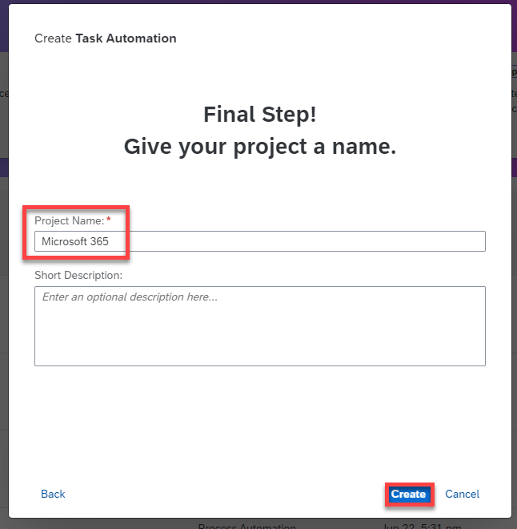

5. Select the agent version that is registered on your system.

    <!-- border -->

6. Provide a name for the automation such as **Automation send email**, and choose **Create**.

    <!-- border -->

### Set up the dependency

You will be navigated to the automation editor where you can build your automation. In order to use Microsoft 365 activities, you need to add the Microsoft 365 Cloud SDK to your project.

1. Choose **Settings**.

    <!-- border -->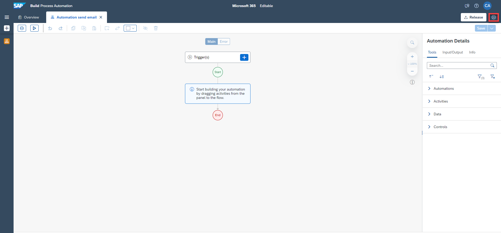

2. In the **Project Properties** window, select **Dependencies > Add dependency > Add a Business Process project dependency**.

    <!-- border -->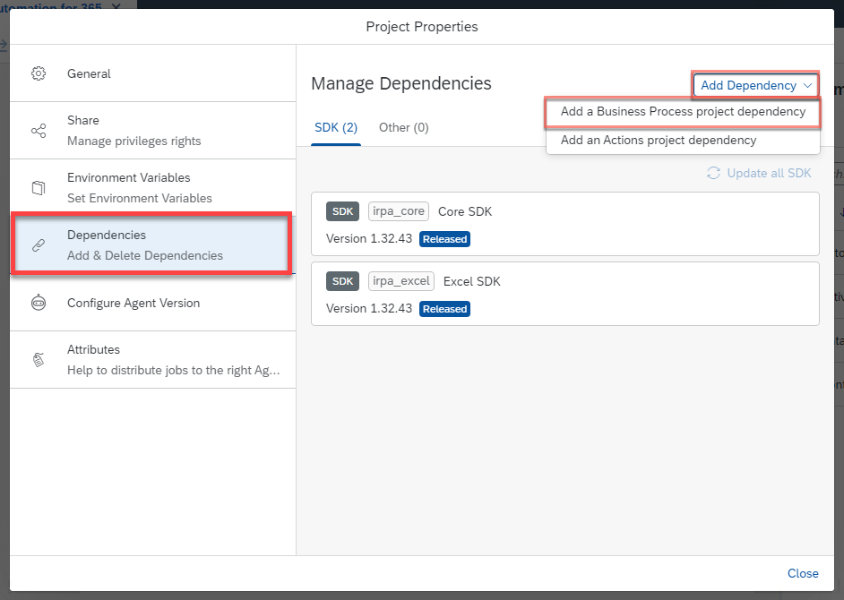

3. Under Add dependency search for **Microsoft 365 Cloud SDK** and **Add** it.

    <!-- border -->

4. **Close** the window.

### Build the automation to retrieve the file details

1. Under **Automation Details** panel, under **Tools**, look for **Select 365online Authentication** activity.

2. Drag and drop the activity into the workflow below Start.

    <!-- border -->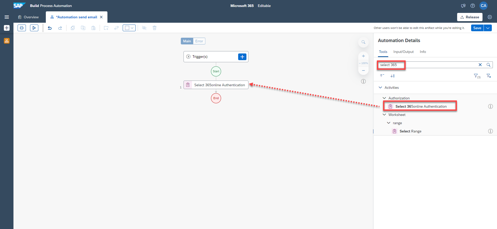

3. Under **Automation Details** panel, under **Tools**, look for **Get Remote File Information** activity. Drag and drop the activity into the workflow.

    <!-- border -->

    > **Get Remote File Information** activity gets information about a remote file using its source URL.

    > It will generate a log message within the tester and the trace file.

4. Select the **Get Remote File Information** activity. In **Input Parameters**, under `sourceURL`, you need to copy and paste the URL provided by Microsoft to open the file. You will retrieve the file URL in the step below.

    > **CAUTION**: It is not the downloaded URL.

5. To retrieve the needed URL, please follow these steps:
    - Go to your One Drive.
    - Choose **My Files**.
    - Find the Orders excel file that you downloaded and saved in your One Drive as mentioned in the pre-requisites, and check it.
    - Choose **Copy link**.

    > **What's going on?:** This is the URL you will copy and paste under `sourceURL` input parameter.

    <!-- border -->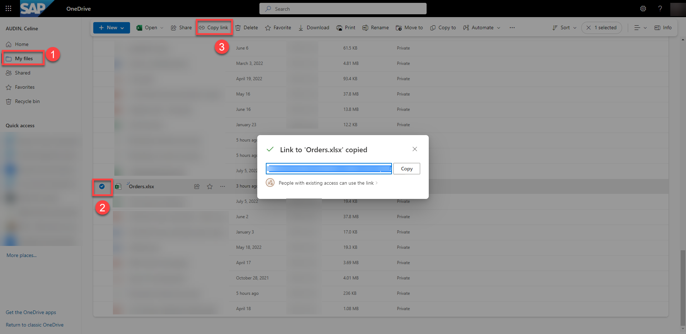

6. Now that you have copied the URL, you may paste it under `sourceURL` input parameter.

    <!-- border -->

7. Under **Automation Details** panel, under **Tools**, look for **Log Message** activity. Add it to the workflow under **Get Remote File Information**.

8. Select the **Log Message** activity. In the Input Parameters, under message choose `fileInformation`.

    <!-- border -->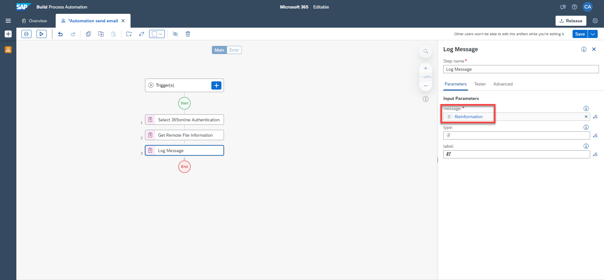

9. **Save** the automation. **Test** the automation.

    <!-- border -->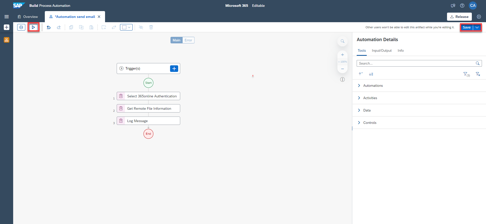

10.  Once the Test is done, go to **Info** in the **Test Console**. Copy:

    - `driveId` value
    - `fileId` value

11. Save the values for later. You will need them when you test your automation.

    > The `driveId` is the ID of the remote SharePoint Drive where the file is located and the `fileId` is the ID of the workbook.

    <!-- border -->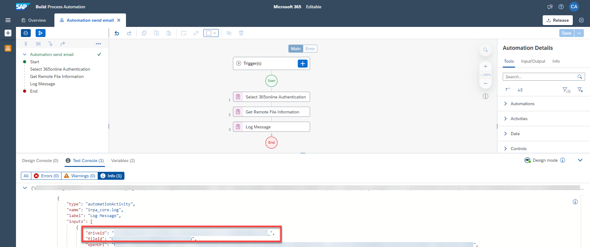

### Create Input Parameters

An input or output parameter is a variable that is passed, received, or sent from one automation, SDK activity or control to another. This variable allows you to manipulate data that you can use in your workflow. Input or output parameters have a name (optionally a description) and data that complies to a type.

For the purpose of this tutorial, you will create input parameters for the two values retrieved above `driveId` and `fileId` as well as for the path to the excel file.

1. In your automation, on the right-hand side panel, go the **Input/Output** section and click **Add new input parameter**.

    <!-- border -->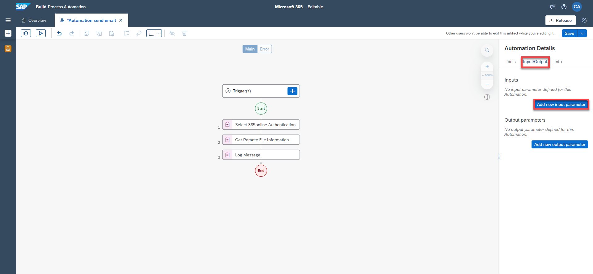

2. Enter a name: `driveId`.

3. Enter a description: ID of the remote Drive where the file is located.

4. Select **String** as type.

    <!-- border -->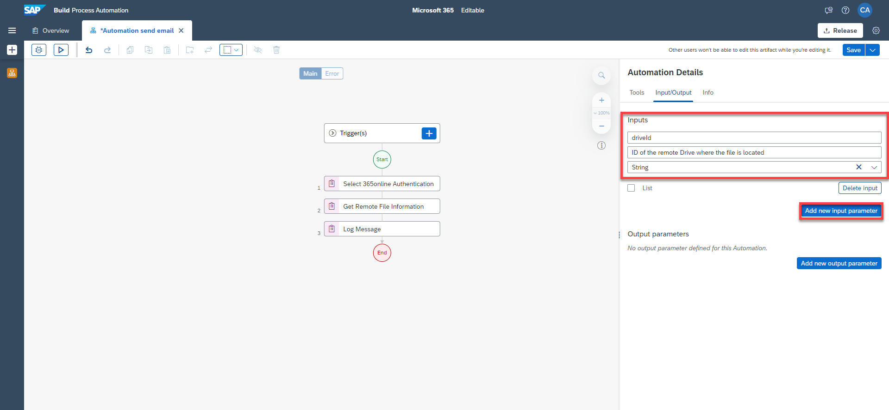

5. In the same way, create two other input parameters as follows:

    |  Field Value  | Input Parameter 1  | Input Parameter 2
    |  :------------| :------------------| :----------------
    |  Name         | `fileId`           | path
    |  Description  | ID of the workbook | Path to the excel file
    |  Type         | String             | String

6. Choose **Save**.

    <!-- border -->

### Build the automation to send an email

1.  Under **Automation Details** panel, under **Tools**, look for **Open Workbook** activity. Drag & drop it into the workflow.

    <!-- border -->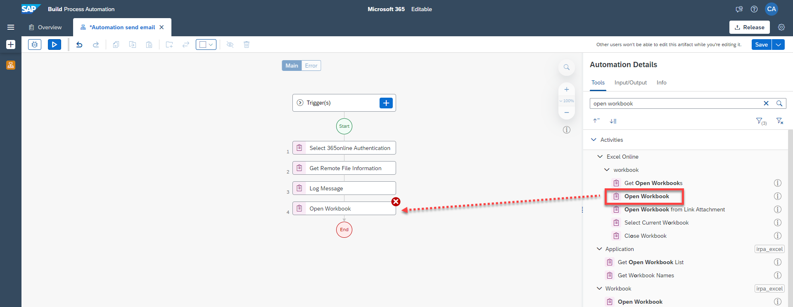

    > This activity opens Excel Workbook.

2. Select the **Open Workbook** activity.

3. Under **Input Parameters**, for `driveId`, you may select `driveId` parameter you just created.

    <!-- border -->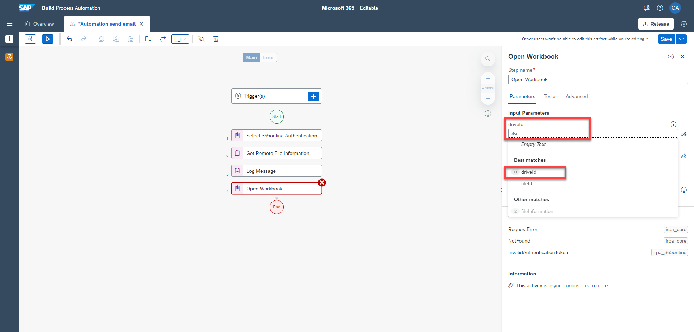

4. In the same way, you will select `fileId` parameter under `pathOrFileId`.

    <!-- border -->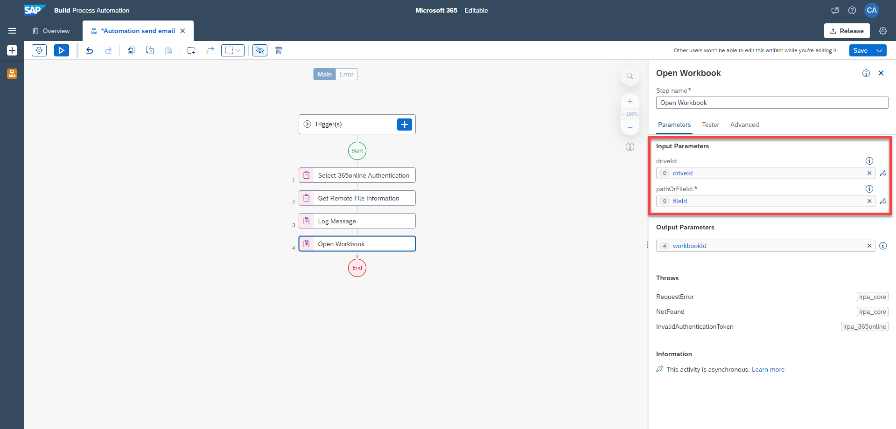

5. Under **Automation Details** panel, under **Tools**, look for **Get Values** activity. Drag & drop it into the workflow.

    <!-- border -->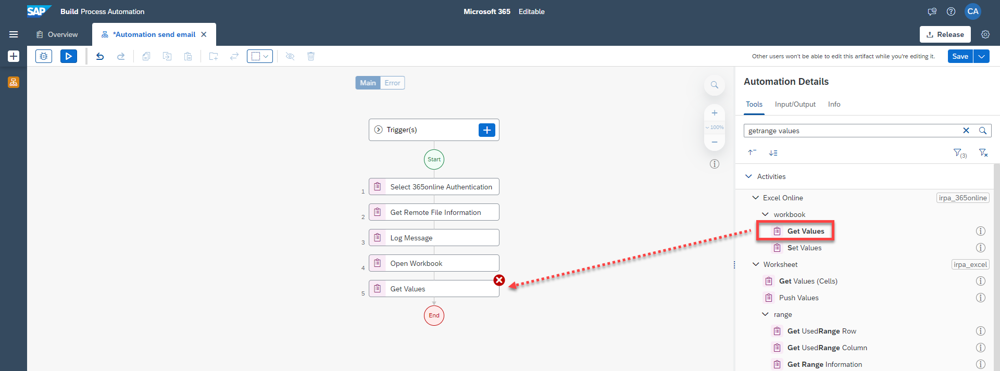

    > This activity retrieves the values, formulas or `numberFormats` from the current worksheet.

6. Select the **Get Values** activity. Under **Input Parameters** in:

    - range Definition enter: **A1:F11** and select the expression in quotes.

    > **What's going on?:** The range definition of the excel file has values up to this range therefore you need to specify those values.

    <!-- border -->

    - format choose: `objectsHeadersOnFirstRow`.

    > This corresponds to the format of the result that will appear in the Test Console.

    <!-- border -->

7. Under **Automation Details** panel, under **Tools**, look for **For Each** control. Drag & drop it into the workflow.

    <!-- border -->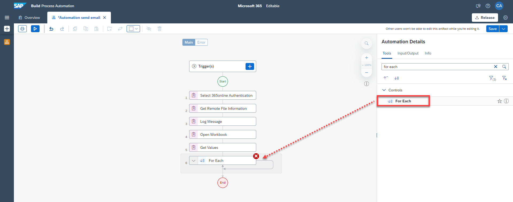

8. Select the **For Each** control. Under **Parameters** in **Set looping list**, choose **result**.

    <!-- border -->

9. Under **Automation Details** panel, under **Tools**, look for **Log Message** activity. Drag & drop it into the workflow inside the **For Each** loop.

    <!-- border -->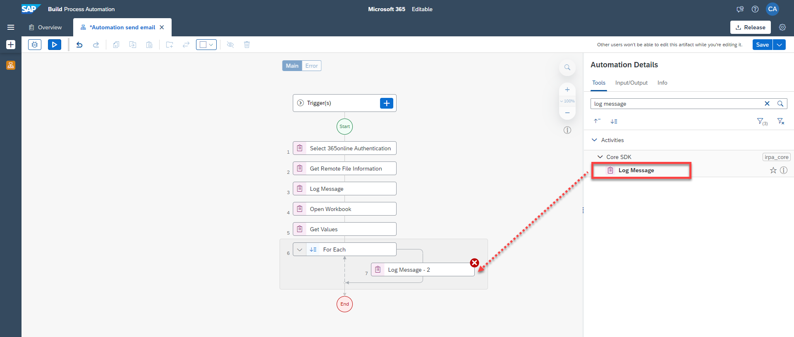

10. Select the **Log Message** activity. Under Input Parameters in message choose `currentMember`.

    <!-- border -->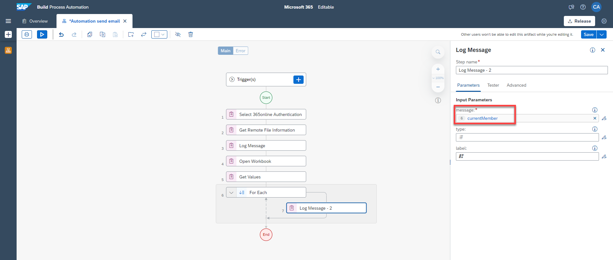

11. Under **Automation Details** panel, under **Tools**, look for **Download File** activity. Drag & drop it into the workflow outside the **For Each** loop.

    <!-- border -->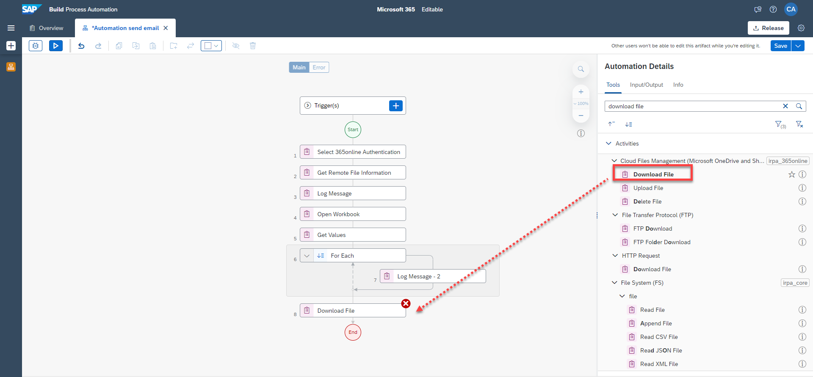

12. Select the **Download File** activity. 

13. Under **Input Parameters**:
    - for `driveId`: select parameter `driveId`.
    - for `pathOrFileId`: select parameter `fileId`.
    - for `localFilePath`: select parameter **path**.

    > `localFilePath` corresponds to the path to the file which will store the data on your machine.

    <!-- border -->

14. Under **Automation Details** panel, under **Tools**, look for **Send E-mail** activity under **Outlook Online**. Drag & drop it into the workflow just below **Download File** activity.

    <!-- border -->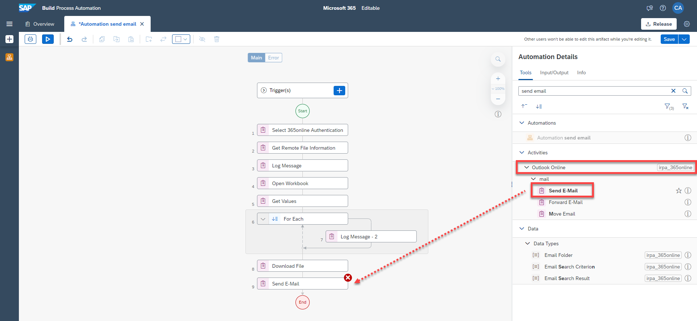

    > This activity will send an email using Outlook Online.

15. Select the **Send E-mail** activity. In Input Parameters under `mailDescription` choose **Create Custom Data**.

    <!-- border -->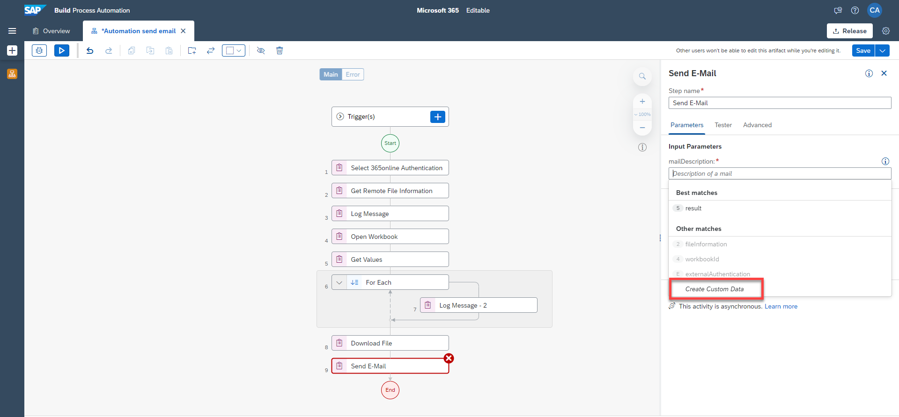

16. Customize the Email:
    - Under subject enter: **Your list of orders** and select expression in quotes.
    - Under body enter: **Hello, Your list of orders is ready for you.** and select expression in quotes.
    - Under `toRecipients`, select **+** and add your email address. Select the expression in quotes.

    <!-- border -->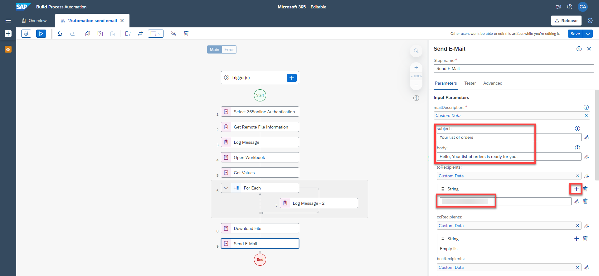

    - Under attachments, select **Custom Data** and **+** to add the name and path parameter:
        - In the name field, enter **ListOfOrders.xlsx** and select the expression in quotes. 
        - In the path field, select parameter **path**.

    > **path** corresponds to the path of the file which will be added to the email message.
  
    <!-- border -->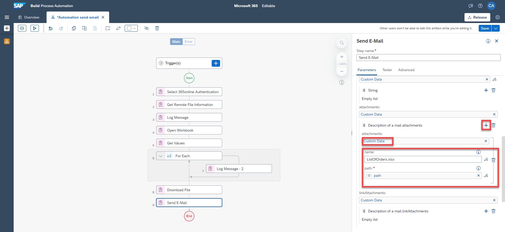

17. Under **Automation Details** panel, under **Tools**, look for **Remove File/Folder** activity. Drag & drop it into the workflow.

    <!-- border -->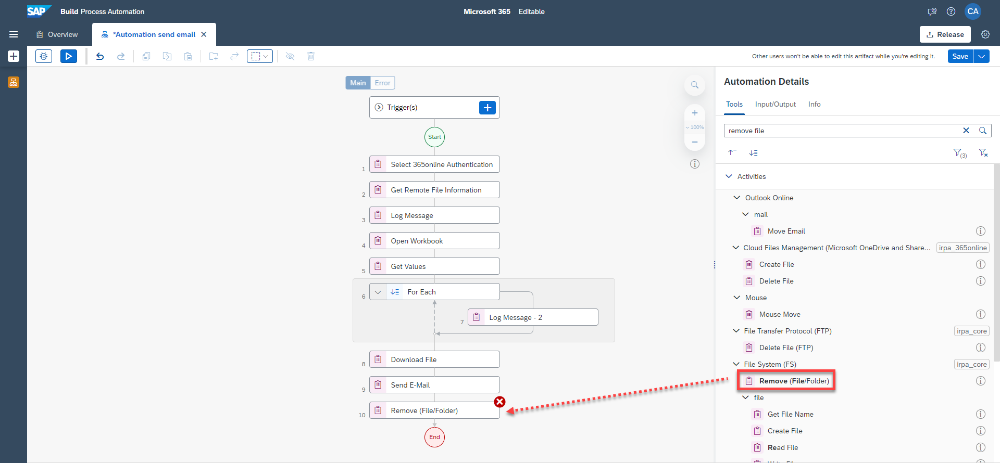

18. Select the **Remove File/Folder** activity. 

19. Under **Input Parameters**, for **path**, select the parameter **path**.
    
    > **path** is the path of the file that will be removed once email is sent.

20. **Save** your work.

    <!-- border -->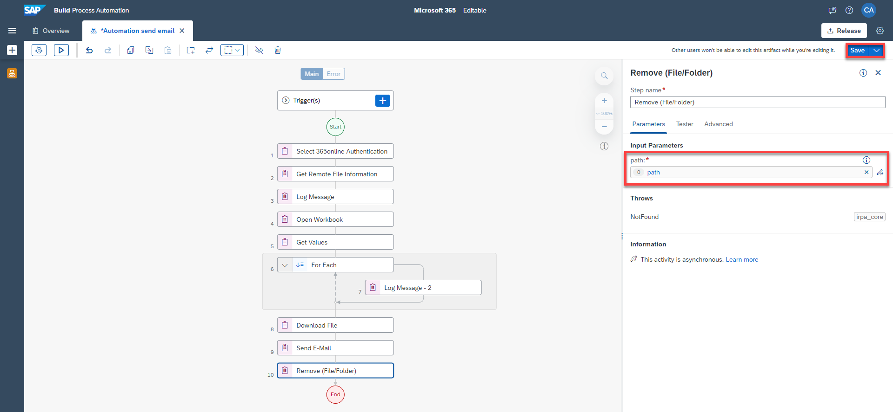

### Test the automation

1. Once the automation is saved and ready you can test it. Choose **Test** button.

    <!-- border -->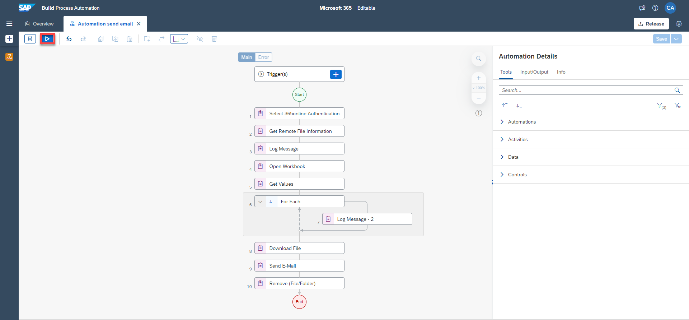

2. Now you will enter the actual values of the **Input parameters**.

    - For `driveId`: you will enter the value that you retrieved in step 5.
    - For `fileId`: you will enter the value that you retrieved in step 5.
    - For **path**: you will enter the path to the excel file.

3. Choose **Test**.

    <!-- border -->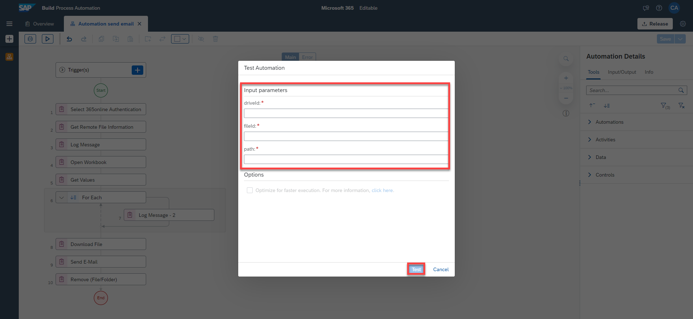

    The BOT opens the **Orders** excel file in your share point, reads the value from the excel, downloads the file to you system and sends an email with `ListOfOrders` excel file as an attachment via Outlook Online.

    <!-- border -->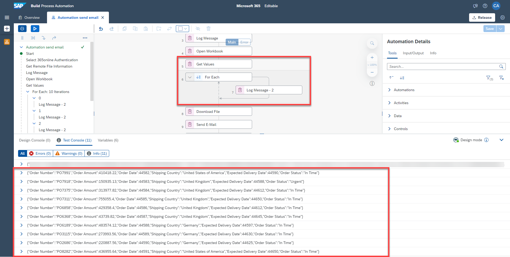

4. Check your Outlook Inbox to see the email that was send with the attachment.

    <!-- border -->

---
