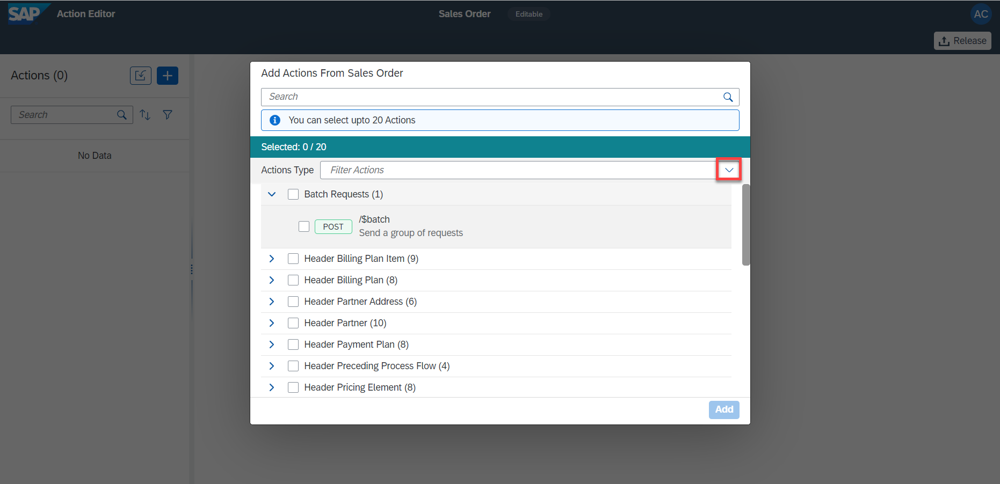
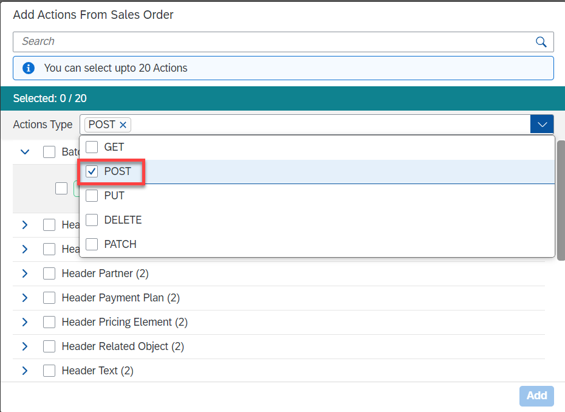
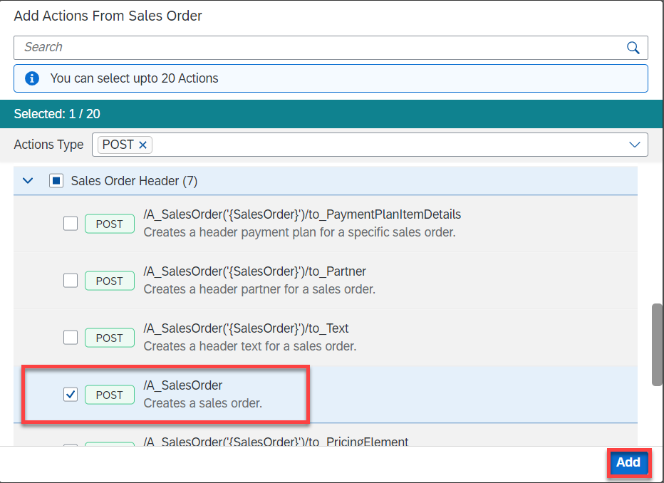
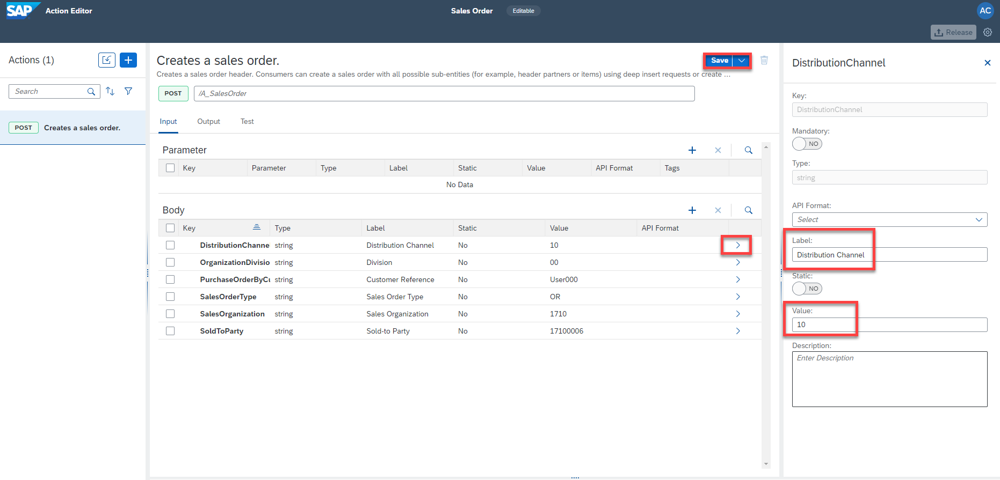
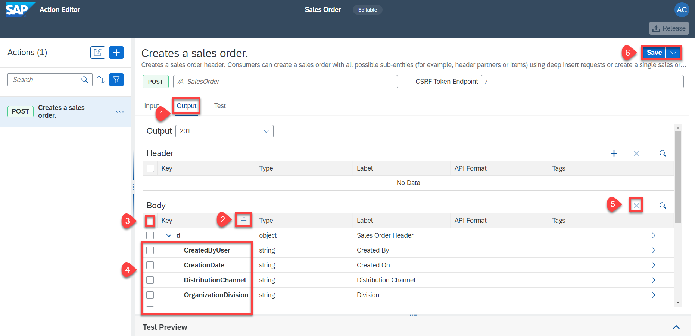

# Create Action Project in Lobby
<!-- description --> Create an action project in lobby from OpenAPI specification

## Prerequisites
- [SAP BTP Free Trial Account](https://blogs.sap.com/2022/09/09/sap-process-automation-now-available-in-your-trail-account/)  **OR**
  [SAP BTP Free Tier Account](spa-subscribe-booster) with the SAP Build Process Automation enabled
- S/4HANA Cloud system where Sales Order business module is available
- A communication user to access S/4HANA Sales Order inbound services based on `SAP_COM_0109` communication scenario ID

## You will learn
- to discover APIs in SAP API Business Hub
- to download Open API specification
- to create action project based on the API specification
- to configure API methods to update title, input and output fields and their description to improve readability for business users
- to test API using destination option
- to release and publish action project to be consumed in the business process modelling

## Intro
Action is a feature in **SAP Build Process Automation** to connect processes with external systems, be it SAP or non-SAP systems. This is an important piece of the puzzle especially if you want to automate or extend your business processes for any available LoB processes like S/4HANA, `Ariba`, SuccessFactors etc. These extensions can be easily build using SAP Build Process Automation, and using actions you can connect to your given S/4HANA, `Ariba` or other SAP LoB systems for any kind of GET, POST, PATCH and other calls.

In this tutorial, you will create an action project based on Sales Order API. The [Sales Order (A2X)](https://api.sap.com/api/API_SALES_ORDER_SRV/resource) API is already available in API Business Hub. For this workshop you will leverage **Sales Order Header - POST API** which will be used to create a sales order in S/4HANA Cloud system after the approval is done.

The same scenario can be used for posting an invoice to the S/4HANA system after approval from business process or getting the employee details from SuccessFactors system for off-boarding process or updating purchase requisition details for the changes in the order in `Ariba` system or getting asset details from Asset Management system before sending it for approval for asset depreciation. There are many such real-world examples where you can use action concept to create, fetch or update the data in the backend system based on the process outcomes (approval, validation etc.)

### Download open API specification

1.  [Download and extract]() **Open API Specification** zip file for **Sales Order (A2X)** API in your local file system.

> Open API specification of 2.x or 3.x or higher is needed for creating action project. For APIs that are available in [SAP API Business Hub](https://api.sap.com), you can directly download the specification from the API overview section. For example: The API specification that will be used for sales order creation in this exercise is downloaded from [here](https://api.sap.com/api/API_SALES_ORDER_SRV/overview).

### Create action project

2.	Open **SAP Build Lobby** with your username and password:

    - then click **Create**.

    <!-- border -->

3. In the popup, choose **Build an Automated Process** and then select **Actions**.

    <!-- border -->

4. In the popup, do the following:
    - Enter the **Project Name** as **Sales Order**.
    - Enter the **Short Description** as **API to create sales order in S/4HANA cloud system**.
    - Click to **Browse** the open specification file downloaded in step above.
    - Click **Create**.

    <!-- border -->

5. Wait for the action project to be created in the Lobby.

    <!-- border -->

### Configure action project

1. Once the action project is created, the action editor will automatically open. In the popup, you have to select *POST* method of `/A_SalesOrder` API. You can either directly search from the given list of APIs or follow the steps below:
    - Select **filter** option.

    <!-- border -->

    - Select **Request Type** >> **POST** and click **OK**.

    <!-- border size:540px -->

    - From the filtered list of APIs, select **POST** option for `/A_SalesOrder` API.

    - Click **Add**.

    <!-- border -->

2. Action editor will be opened with the selected APIs which can be further configured based on the requirements:

    - To update the project name, click on the **pencil icon** next to the project name.
    > This action project name will help you search your action project from your API list, once published in action repository.

    <!-- border -->

    - Change the name to **Create a sales order**.
    - Once done, select **check** icon to submit the changes.

    <!-- border -->

3. Now, you will update the input/output fields of the action project to keep only the mandatory fields that are needed to create the sales order. To select the  **Input** fields, do the following:

    - Sort **Key** in ascending order by clicking on the key column and select the **Sort Ascending** option.

    <!-- border -->

    - Select All the fields by clicking on the checkbox of **Key** column.
    - Uncheck the following fields so that they are added as *Input*.

    
    | Keys selected as Input
    | :---------------
    | `DistributionChannel`
    | `OrganizationDivision`
    | `PurchaseOrderByCustomer`
    | `SalesOrderType`
    | `SalesOrganization`
    | `SoldToParty`
    

    - Click **cross** to delete rest of the unwanted fields.

    <!-- border -->

    - In the confirmation popup, click **Remove**.

    <!-- border -->

    > If you get message like *The following parameter(s) can't be added because they have unsupported definition* in the pop up then scroll down to add the individual attributes.
        
    <!-- border -->

    - Enter the default value for each of the input fields.

    
    | Keys selected as Input| Value
    | :--------| :----------
    | `DistributionChannel`| 10
    | `OrganizationDivision` | 00
    | `PurchaseOrderByCustomer` | any name of your choice
    | `SalesOrderType` | OR
    | `SalesOrganization` | 1710
    | `SoldToParty` | 17100006
    

    > Use can also change Labels of the fields.

    <!-- border -->

    - **Save** the changes.

    > If you get Gateway Timeout issue while saving, then close the error dialog and refresh the browser.  

    > If you see that changes are not saved, then try saving again and refreshing the browser.

4. As S/4HANA APIs need CSRF token, click **...** of the POST API on the left panel and select **Enable X-CSRF**.

    <!-- border -->

    - In the popup, enter **/** and click **Add X-CSRF**.

    > Action project uses Destination service to execute the API. In the destination you have already create the URL Path as `https://my-api.s4hana.cloud.sap/sap/opu/odata/sap/API_SALES_ORDER_SRV` to call the API. So, while configuring XSRF token path you do not have to enter any explicit path rather use standard URL configured in the destination.

    <!-- border -->

5. With this you have configured the action project name, XSRF token and API input fields. **Save** the work.

    <!-- border -->

6. Similarly, configure the output fields. Do the following:
    - Click **Output** tab.
    - Sort the keys in **Ascending Order**.
    - Select all the keys.
    - Uncheck the following keys that are needed as *Output*:

    
    | Keys selected as Output
    | :---------
    | `CreatedByUser`
    | `CreationDate`
    | `DistributionChannel`
    | `OrganizationDivision`
    | `PurchaseOrderByCustomer`
    | `RequestedDeliveryDate`
    | `SalesOrder`
    | `SalesOrderDate`
    | `SalesOrderType`
    | `SalesOrganization`
    | `SoldToParty`
    | `TotalNetAmount`

    - Click **cross** to delete rest of the unwanted output fields.

    - **Save** the changes.

    <!-- border -->

    > If you get Gateway Timeout issue while saving, then close the error dialog and refresh the browser.  

    > If you see that changes are not saved, then try saving again and refreshing the browser.

### Test action project

1. Once the action project is configured and saved, it is time to test the changes and output. To test the API, do the following:

    - Click **Test** tab.
    - Select **Destination** option under **Connectivity**.
    - Select **S4HANACloud** from the dropdown options.

    > The destinations are fetched from the SAP Business Technology Platform. The selected destination is already created in the account configured for this workshop.

    > Notice that the input value is already picked from the default value entered while configuring the action project.

    - Click **Test**.

    <!-- border -->

    - Once the execution is successful, you see **201 Created** response with the details of the new sales order being created in the backend S/4HANA Cloud system.

    <!-- border -->

### Release action project

You will now release the action project to create version(s) and then publish a selected version in the action repository. It is then these published actions that can be used in different processes and applications to connect to external systems.

- To release a version of the action project, click **Release** from top-right corner.

<!-- border -->

- In the release popup, enter the **Release Notes** of your choice and click **Release**.

> Notice the version of the project. It is in `majorVersionNumber.minorVersionNumber.patchNumber` format.

<!-- border -->

### Publish action project

Once the action project is released, you can the publish any release version of the action by clicking **Publish to Library** from top-right corner.

<!-- border -->

With this you have successfully completed creating, configuring, releasing and publishing of action project. Now you will use these published actions to connect process to external systems via APIs.
