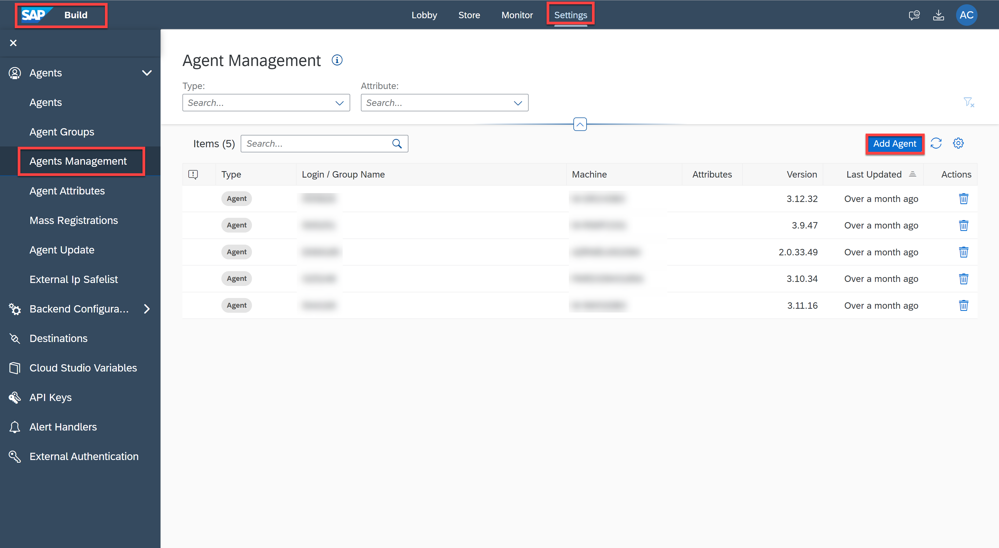

# Agent Management Settings to Execute the Process with an Automation
<!-- description --> Create an agent attribute in the tenant to add it to your agent and project

## Prerequisites
 - Access to a [SAP BTP tenant with SAP Build Process Automation](spa-subscribe-booster)
 - Install and set up the [Desktop Agent 3](spa-setup-desktop-3-0-agent) to run the automation

## You will learn
  - How to create an Agent Attribute in the tenant.
  - How to add the attribute to your agent.
  - How to add the attribute to your project.

## Intro
Agent attributes allow you to sort agents registered within the same tenant and make sure that a specific agent executes the job of your choice.

---

### Add your agent

After you have installed the desktop agent, you need to add your agent so that it is able to run an automation.

1. Navigate to **SAP Build** page. Select **Settings**. Choose **Agents Management** then **Add Agent**.

    <!-- border -->

2. When the pop-up window opens, select your agent and choose **Add agent**.

    <!-- border -->

3. Your agent is now added and ready to run.

    <!-- border -->

### Create an agent attribute in the tenant

Now that you have your project free of errors, ready to be released, you need to add an **Attribute** to your project. But first, you need to create an Agent Attribute.

To do so, please follow these steps:

1. Navigate to the **Build** page, select **Settings**.

2. Choose **Agent Attributes**.

3. Choose **Create Attribute**.

4. In the **Create Agent Attribute** dialog box, please enter **My Agent Attribute** in the **Name** field.

5. From the **Type** dropdown list, select **Predefined** if you wish to add values or else leave **Free** as **Type**.

    > - **Free** – With this type of attribute, you won't be able to add any predefined value. Whenever you want to use this attribute, you will be able to parametrize the value of this attribute.
    > - **Predefined** – With this type of attribute, you will be able to populate values for any specific attribute.

6. In the **Values** field, you may enter any value you wish (i.e. employee ID).

7. Choose **Create**.

    <!-- border -->  

### Add the attribute to your agent

1. Choose **Agent List**, then search for your agent and verify that it is idle or ready and connected in unattended mode then click on it.

    <!-- border -->

2. Choose **Manage Attributes**.

3. In the **Manage Matching Attributes** dialog box, add your attribute:

      - From the drop-down list, select **My Agent Attribute**
      - Enter the value you selected previously in the **Values** field and press **ENTER**
      - Choose **Confirm**

    <!-- border -->

### Add the attribute to your project

1. Navigate back to your project in the Process Builder.

2. Choose **Settings**.

3. Select **Attributes**.

4. From the dropdown list, select **My Agent Attribute**.

5. Enter your value in the **Values** field and press **ENTER**.

6. Choose **Save**.

7. Choose **Close**.   

      <!-- border -->

### Desktop agent in unattended mode

When you are running the process make sure to have the Desktop Agent in unattended mode.

1. Open the Desktop Agent 3 from the `systray`.

    <!-- border -->

2. Select **Settings** in the Menu and choose **Mode Settings**.

    <!-- border -->

3. Set the Desktop Agent 3 to Unattended mode by selecting **Activate**.

    <!-- border -->

---
