# Use Google Workspace to work with Gmail
<!-- description --> Use Google Workspace to search, read and send a Gmail reply

## Prerequisites
 - Complete [Google Authorization](spa-authorize-google-sdk) tutorial
 - Install and set up the [Desktop Agent 3](spa-setup-desktop-3-0-agent) to run the automation

## You will learn
 - How to use Google Workspace SDK to Search Gmail account
 - How to use Google Workspace SDK to Read the email and download the attachments from the email.
 - How to use Google Workspace SDK to Reply to the original email

## Intro
SAP Build Process Automation enables automation of google workspace products such as Gmail, Google drive, Google calendar, Google sheet, Google slides, Google documents and Google cloud storage. In addition to that it has the capabilities to automate ML based services such as Google document AI and vision AI.

In this tutorial, you will use Google Authorization SDK and Google Workspace SDK to automate the google application Gmail. You will build an automation that will search for an email in the user's Gmail account based on query input and then read the email contents. It will download the attachments to a local File System and finally reply to the original email.

---

### Create an automation

1. In the **Lobby**, select the **Google Workspace** project.

2. In **Build Process Automation**, choose **Create** and then select **Automation**.

    <!-- border -->

3. In the **Create Automation** window, enter **Google Workspace-Gmail** as name and **An automation to use Gmail** as a description.

    <!-- border -->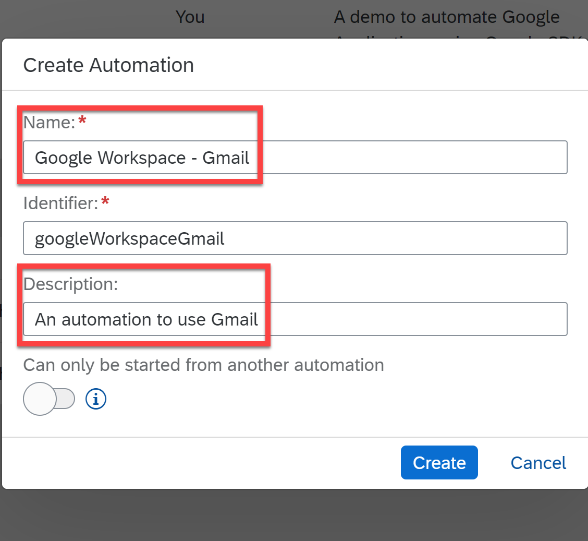

    You will be navigate to the automation editor of the newly created Automation.

### Add Google Workspace SDK

In the previous [tutorial](spa-authorize-google-sdk), you have added the Google Authorization SDK to authorize SAP Build Process Automation to automate Google Applications, now you will need to add Google Workspace SDK to use and automate Google services.

1. From the automation editor, navigate to **Settings**.

2. Select **Dependencies** and choose **Add Dependency** and **Add a Business Process project dependency**.

3. From the drop down, select Google Workspace SDK, choose a version and **Add**.

4. The dependency is successfully added. You may close the **Project Properties** window.

    <!-- border -->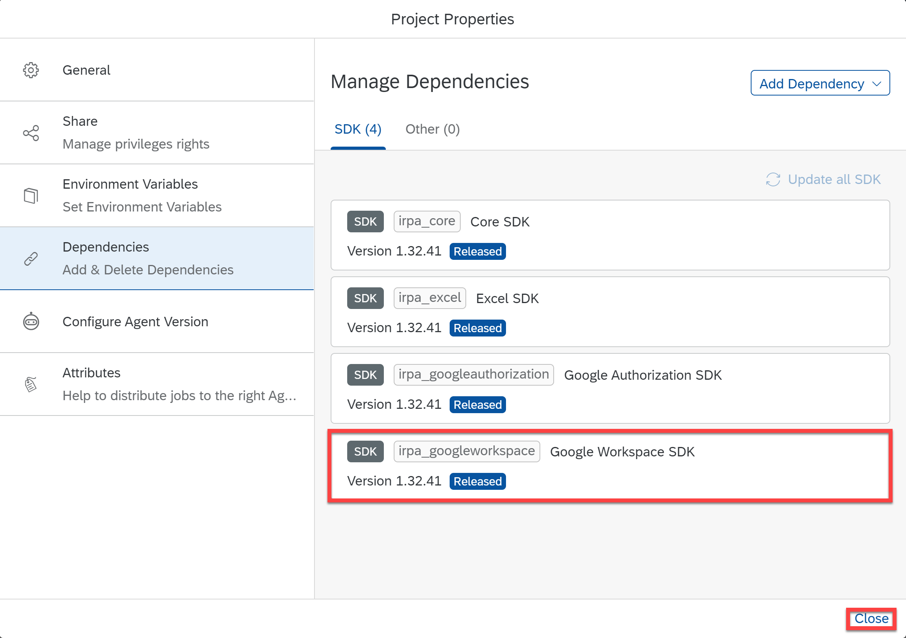

### Add input parameters

You will add two input parameters.

1. In the **Automation Details** panel, under **Input/Output**, choose **Add new input parameter**.

2. Add two input parameters as follows:

|  Field          | Input Parameter 1 | Input Parameter 2
|  :------------- | :-------------    | :----------
|  Name           | `searchSubject`    | `searchFrom`
|  Type           | String            | String

<!-- border -->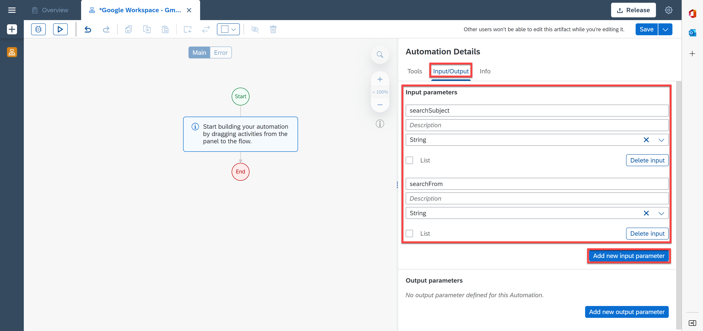

### Build an automation to use Gmail

1. In the **Automation Details** panel, under **Automations**, drag and drop the [Google Authorization](spa-authorize-google-sdk) automation you created in the previous tutorial. This will allow you to authorize SAP Build Process Automation to automate your Google Applications.

    <!-- border -->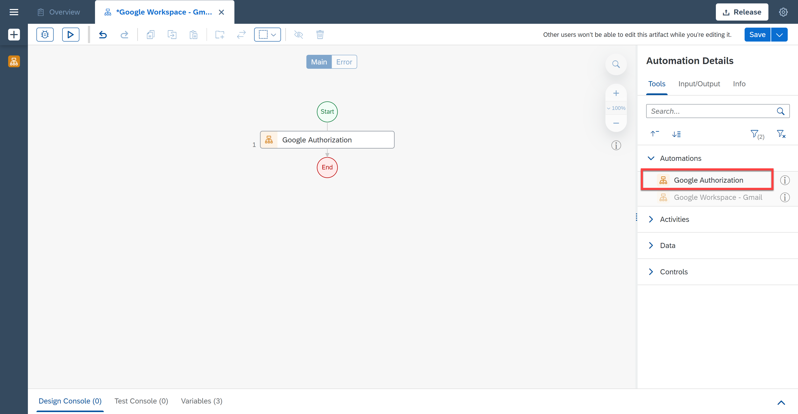

2. In the **Automation Details** panel, under **Tools**, search for the **Try** activity.

3. Drag and drop the activity into the workflow just below **Google Authorization** automation.

    <!-- border -->

4. Select the **Try** activity.

5. Under the activity parameters, as **Errors to catch** select **`GmailError`**.

    <!-- border -->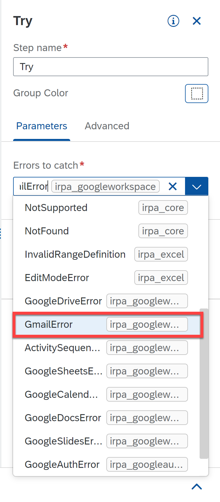

6. Now search for the **Search Emails (Gmail)** activity and drag and drop it into the workflow, just below the **Try**.

    > Add Search Emails (Gmail) activity to search for a specific email in your Gmail account. This activity uses GMAIL API to search for emails based on the search filters as specified in the search query Parameters. You can optionally also specify if the search should include spam and trash folders or not. Output of this activity is a list of Metadata of the emails that match search criteria.

    <!-- border -->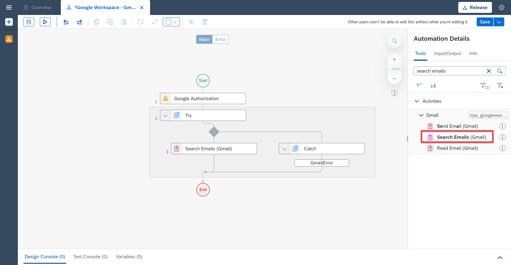

7. Select the activity.

8. Under **Input Parameters**, next to the **query** field, choose the pencil to edit the expression.

9. In the expression editor, copy and paste the following code:

    `"subject:" + Step0.searchSubject + " AND from:" + Step0.searchFrom`

10. Choose **Save Expression**.

    <!-- border -->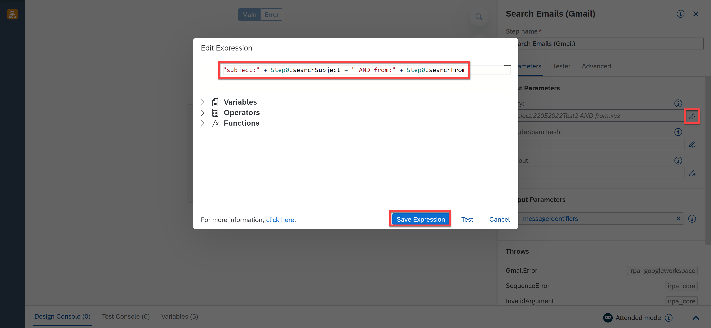

11. For the **`includeSpamTrash`** field, select **false**. This indicates that you do not want to search emails in your Spam and Trash folders.

    <!-- border -->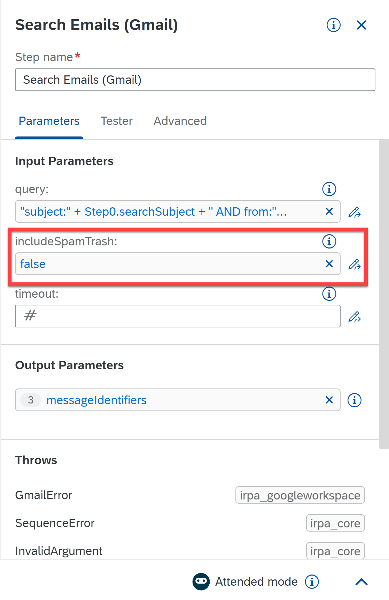

12. Now search for the **Condition** control and drag and drop it into the workflow below **Search Emails** activity.

13. Select the control.

14. Change the **Step name** to: is mail found?

15. Under **Parameters** for **Condition Expression**, choose the three dots and select **Edit Formula**.

    <!-- border -->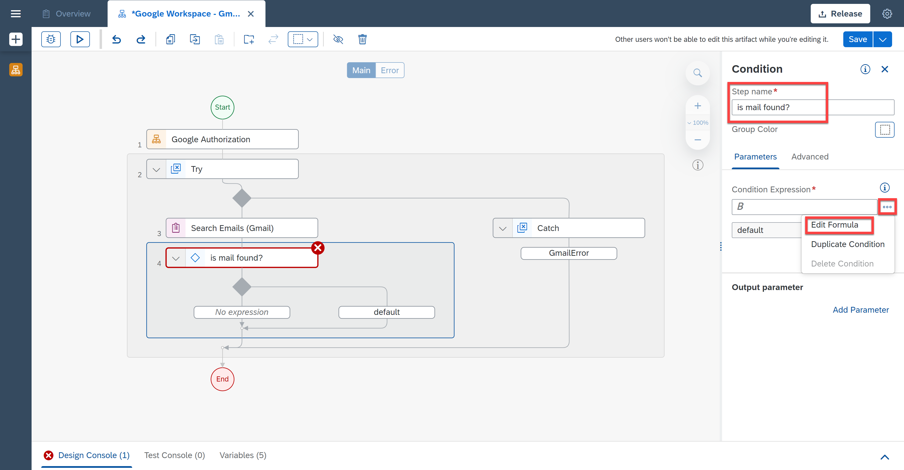

16. In the expression editor, copy and paste the following code:

    `Step3.messageIdentifiers.length > 0`

17. Choose **Save Expression**.

    <!-- border -->

18. Now search for the **Read Email (Gmail)** activity and drag and drop it into the workflow just below the condition control.

    > Add Read Email (Gmail) activity to read the contents of the email. This activity needs Message Id and a location to download media attachments (if any). Using this activity, you can download the attachments of an email into your local file system, or you can upload the attachments to Google Drive. You can use the output of Search activity (previous step) to give `messageId` input of this activity. Output of this activity is the content and details of the targeted message.

19. Choose the activity and under **Input Parameters**, choose the pencil next to the **`messageId`** field.

20. In the expression editor, copy and paste the following code:

    `Step3.messageIdentifiers[0].messageId`

21. Choose **Save Expression**.

    <!-- border -->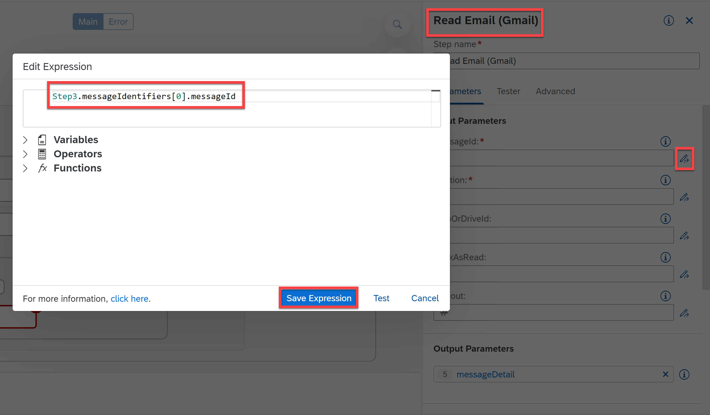

22. For **location** field, select **drive**.

23. Finally, for **`markAsRead`** field, select **true**.

    <!-- border -->

24. Search for the **Send Reply** activity and drag and drop it into the workflow just below the **Read Email** activity.

25. Select the activity and under **Input Parameters**, for the **`replyParameters`** field, select **Create Custom Data**.

    <!-- border -->

26. Select the pencil next to the **`threadId`** field.

27. In the expression editor, copy and paste the following code:

    `Step3.messageIdentifiers[0].threadId`

28. Choose **Save Expression**.

    <!-- border -->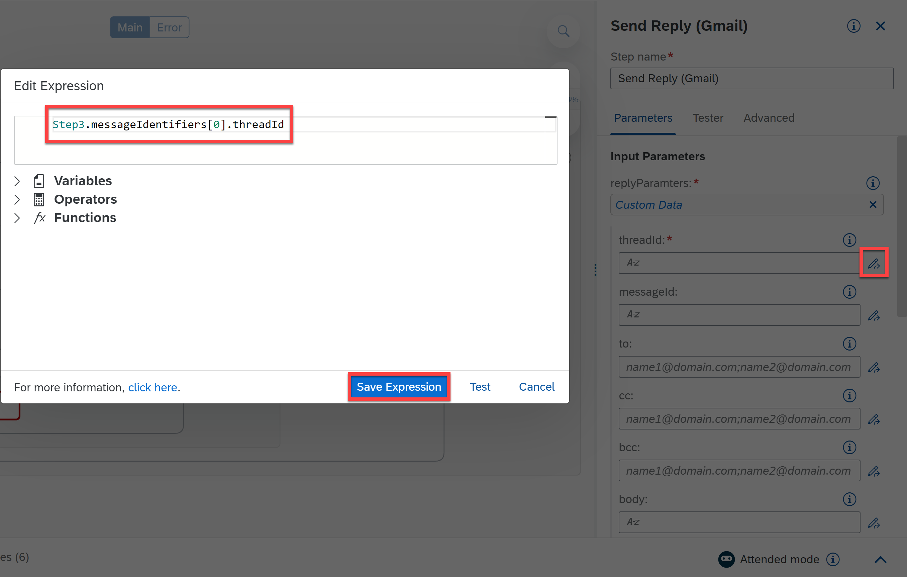

29. Select the pencil next to the **`messageId`** field.

30. In the expression editor, copy and paste the following code:

    `Step3.messageIdentifiers[0].messageId`

31. Choose **Save Expression**.

    <!-- border -->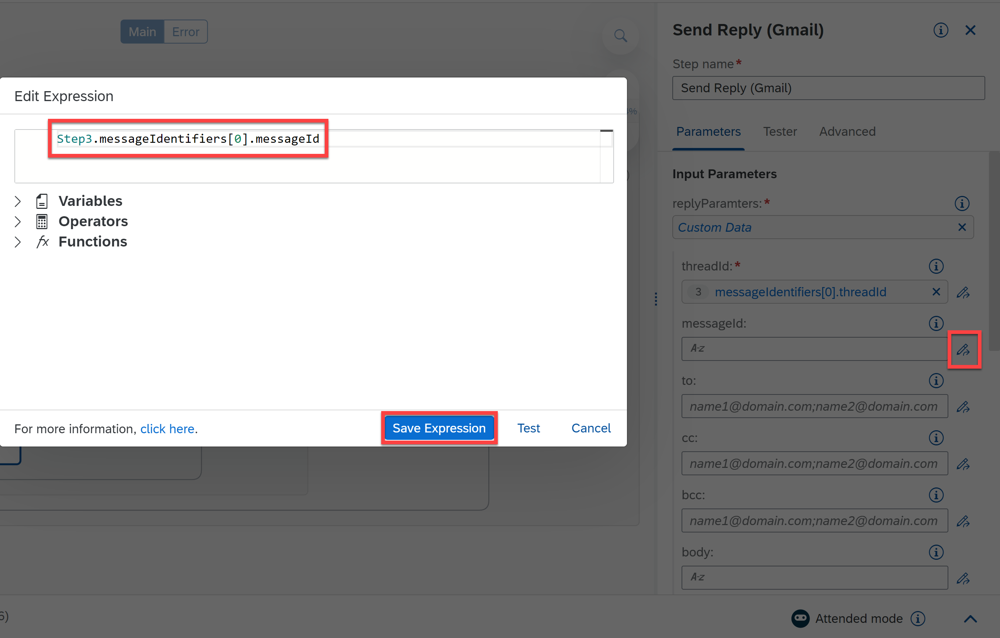

32. For **body** field, enter: **Thanks for sending the list. I will look into it** and select the quotes option.

33. Choose **Save**.

    <!-- border -->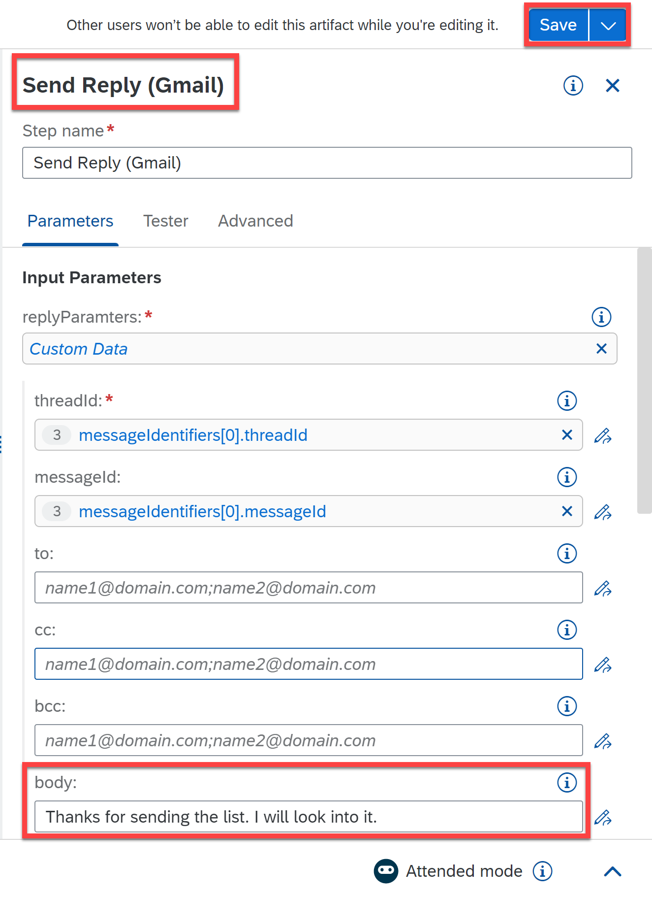

34. Search for **Disconnect** activity and drag and drop it into the workflow just below **Send reply** activity.

    You will now log a message in the case no email is found.

35. Search for a **Log Message** activity and drag and drop it into the workflow just below the **Catch**.

    <!-- border -->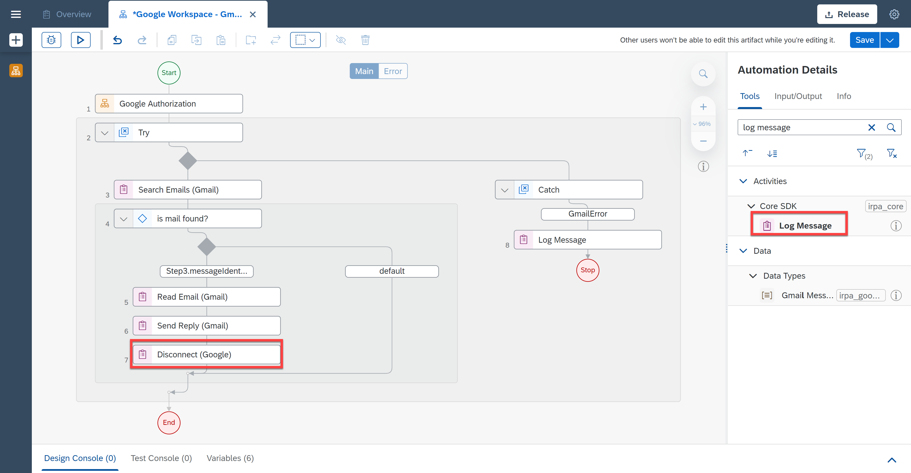

36. Select the activity and under **Input Parameters**, for **message** select `2 error`, for **type** select **error** and for **label** enter **Normal workflow has interrupted due to some error(s). Please check.**, selecting the expression in quotes.

    <!-- border -->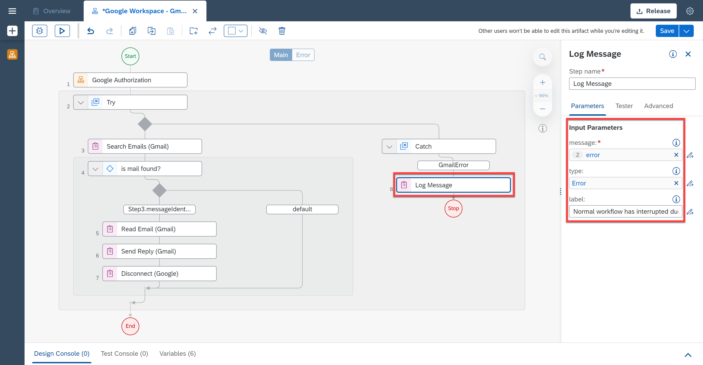

37. Search for **Disconnect** activity and drag and drop it into the workflow just below **Log Message** activity.

38. Finally you will put an end to the automation in error. Search for the control **Stop automation in error** and drag and drop it into the workflow below **Disconnect**.

39. Select the **Stop** control and under **Parameters** select the option **`Rethrow caught error`**.

    <!-- border -->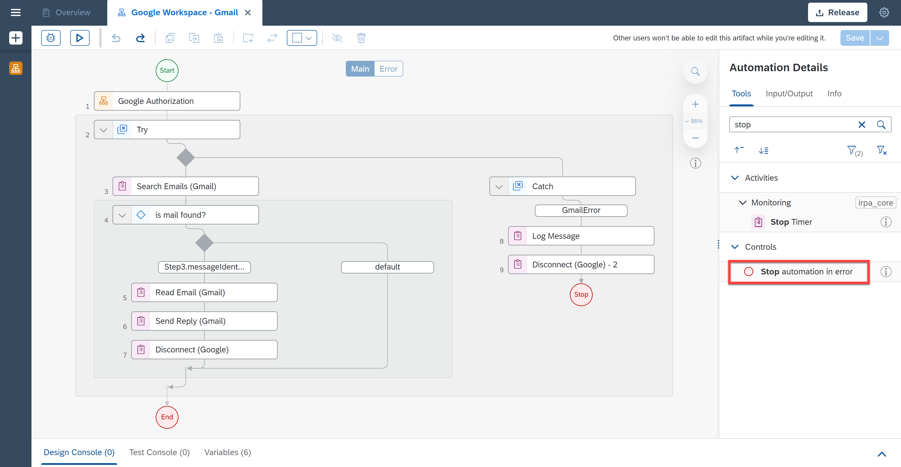

### Test Google Workspace for Gmail

1. Choose **Test**.

2. Fill in the **Input parameters**:
    - For `searchSubject`: the subject of the email you want to search in Gmail
    - For `searchFrom`: the email you want to search in Gmail

3. Fill in the **Environment Variables**:
    - For `userEmail`: your Gmail user email
    - For `serviceAccountKeyPath`: the full path to the json file

4. Choose **Test**.

    <!-- border -->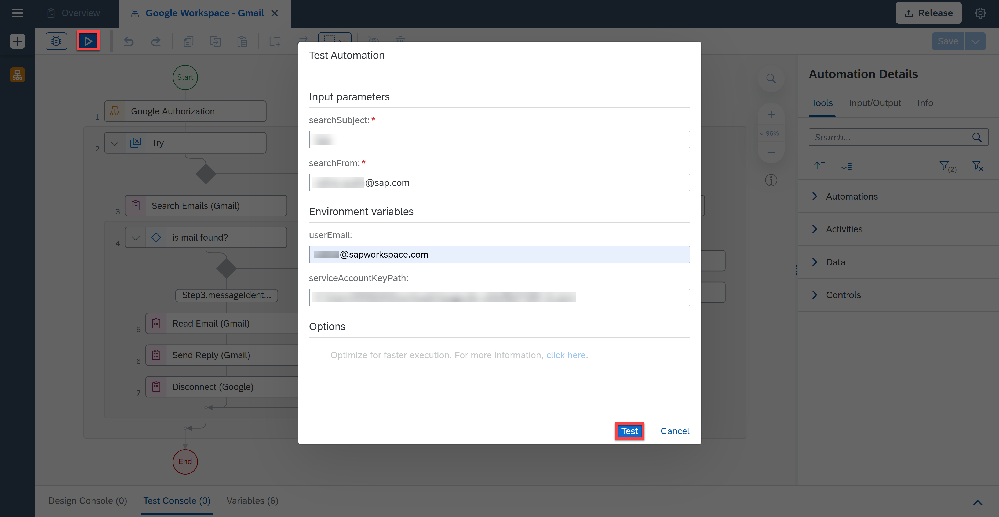

    The testing was successful.

    <!-- border -->

    After searching in Gmail for the email(s), the automation will read the email(s) found, store the attachment(s) if any in your Drive and send a reply to a specified recipient from your gmail account.

    <!-- border -->
---
